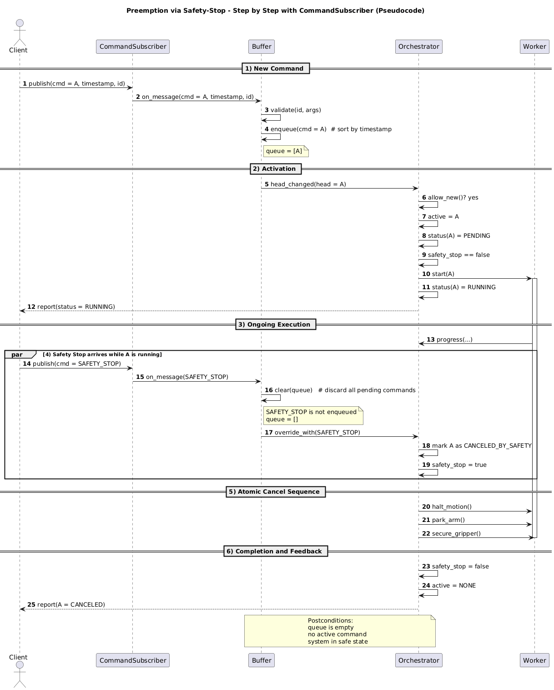
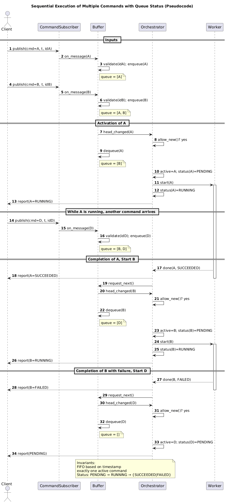

# **Requirements Specification**

**Project Title:** Non-Invasive Condition Monitoring Using Mobile Robotics

**Project Engineer:** Marcel Stemmeler

**Project Sponsors:** Hochschule Bonn-Rhein-Sieg / Fraunhofer IAO

**Created on:** 09.06.2025

**Version:** 1.3

---

### **1 Introduction**

This requirements specification describes the functional and non-functional requirements for a robotic navigation system based on the Boston Dynamics Spot platform, utilizing the official ROS 2 package (*spot_ros2*).  
The goal is to enable the system to autonomously navigate to designated targets and, using a manipulable sensor head, perform structured surface scans.  
This document serves as a foundation for further project implementation and the subsequent master’s thesis.

---

### **2 General Information**

#### **2.1 Purpose of the Document**

This document defines the framework conditions, requirements, and objectives for the planned subproject.  

#### **2.2 Initial Situation**

Many existing industrial systems can only be retrofitted with internal sensors at significant cost and effort.  
Non-invasive mobile diagnostic systems offer a flexible and cost-effective alternative.  
The Boston Dynamics Spot provides a mobile and stable platform equipped with a manipulator arm, enabling such applications.

#### **2.3 Project Context**

This project is part of a larger research initiative focused on automated external fault diagnosis in industrial environments.  
It provides the foundational functionality — navigation and manipulation — upon which the subsequent master’s thesis will build, extending the system with sensor integration and fault evaluation.

#### **2.4 Abbreviations**

| Abbreviation | Meaning |
|---------------|----------|
| ROS | Robot Operating System |
| SLAM | Simultaneous Localization and Mapping |
| GUI | Graphical User Interface |
| API | Application Programming Interface |
| HAL | Hall Effect Sensor |
| BT | Behaviour Tree |

#### **2.5 Distribution and Approval**

| Role | Name | Note |
|------|------|------|
| Project Engineer | Marcel Stemmeler | Student, H-BRS |
| Supervisor | Prof. Dr. Breuer | H-BRS |
| Second Examiner | Dr. Truong Le | Fraunhofer IAO (external) |

---

### **3 Concept**

#### **3.1 Objectives of the Provider**

* Development of a prototype navigation and manipulation solution based on Spot and ROS 2
* Validation in both simulation and real laboratory environments
* Documentation and reusability for future projects

#### **3.2 Objectives and Benefits for the User**

* Automated condition assessment without internal sensor integration
* Reduction of manual inspection efforts

#### **3.3 Target Audience**

* Research groups and developers in robotics and condition monitoring
* Technical operators of industrial systems (e.g., energy networks, pipelines)
* Universities and research partners working on autonomous inspection robotics

---

### **4 Functional Requirements**

The following requirements are supported by diagrams in the appendix, including a high-level architecture diagram and optionally sequence or component diagrams illustrating structure and workflows.

* **Map Management:**
    * Maps can be created, saved, loaded, and expanded or updated as needed.
    * Filters are applied to ensure data quality, e.g., removing false obstacles caused by floor artifacts or reflective surfaces.

* **Navigation Process:**
    * Navigation goals (*probe points*) are manually marked on the map.
    * The system plans paths to these targets based on the active map and automatically avoids dynamic obstacles.

* **Visual Detection:** Detection of target markers (e.g., AprilTags).

* **Trajectory Planning and Execution (Arm):**
    * Marker-based definition of probe points: target poses derived from AprilTags with optional offsets.

* **ROS 2 Integration:** All components (navigation, manipulation, sensing) are integrated via the official *spot_ros2* package, serving as the main interface between the system and the Spot robot.

* **User Interface (optional):** Provides central control functions.

* **Command Recording and Playback:**
    * Record and store executed command sequences.
    * Replay saved command sequences.
    * Manage stored sequences (delete, list).

---

#### **UI Control**

The user interface allows:

* Sending commands — simple or complex — with parameters (e.g., tag ID, offsets, duration).
* Managing probe points — selecting, reordering, skipping, or revisiting.
* Mapping actions — create, save, load maps.
* Safety functions — emergency stop, E-stop status display.
* Recording/Playback — start, stop, play, delete; select from available list.
* Status views — visible and reachable markers, active command, queue contents, playback state, and error messages.

**Operation Principles**

* All UI commands follow the same execution path as externally sent commands.
* The UI continuously displays the latest known system state and updates automatically.

---

### **5 Non-Functional Requirements**

#### **5.1 General Requirements**

* Modular ROS 2 design
* Expandability for later sensor integration
* All subsystems should be loosely coupled and modularly developed to allow quick replacement or adaptation if requirements or priorities change.
* The design philosophy ensures that even major behavioural changes (e.g., replacement of navigation or manipulation strategies) can be implemented with reasonable effort.

#### **5.2 Technical Requirements**

* **Frameworks:** ROS 2 Humble, *spot_ros2*, *moveit2*, *nav2*, *apriltag_ros*, *rtab_map*
* **Version Control:** GitHub ([https://github.com/heini208/fault_detector_spot](https://github.com/heini208/fault_detector_spot))
* **Communication:** ROS 2 topics, services, and actions; behaviour control via behaviour trees (*py_trees*).
* **Deployment:** Runs on Fraunhofer-owned Linux systems compatible with ROS 2.

#### **5.3 Hardware Requirements**

* Boston Dynamics Spot robot
* Spot Arm (manipulator)
* Development workstation with ROS 2 support
* AprilTag markers
* Prototype sensor head (mockup) with integrated HAL sensor for navigation and manipulation tests
* Example test objects: two DC motors — one imbalanced, one fault-free — for realistic test runs and magnetic field measurements using the HAL sensor.

---

### **6 Deliverables**

#### **6.1 Scope of Delivery**

* Navigation and arm control on the real Spot robot
* Simulation environment (Webots or Gazebo)
* Prototype sensor head (mockup for mounting and collision testing)
* Technical documentation, including diagrams, screenshots, and flowcharts
* Command recording and playback functionality

#### **6.3 Delivery Date**

* Project completion and handover on 24.09.2025

#### **6.4 Delivery Address**

* Fraunhofer IAO, Stuttgart / H-BRS, Sankt Augustin

---

### **7 Acceptance Criteria**

* Fully functional demonstrator with navigation, object detection, and scanning capability
* Functionality verified in both real and/or simulated environments
    * Documented test runs
* Acceptance by first and second examiner
* Complete written documentation available

---

## **8 Appendix**

#### **Relevant References**

**Software and System Sources:**

* Spot ROS 2 Driver: [https://github.com/bdaiinstitute/spot_ros2](https://github.com/bdaiinstitute/spot_ros2)
* Project Repository (current system state): [https://github.com/heini208/fault_detector_spot](https://github.com/heini208/fault_detector_spot)
* RTAB-Map (SLAM Framework): [https://github.com/introlab/rtabmap](https://github.com/introlab/rtabmap)
* py_trees (behaviour tree framework): [https://github.com/splintered-reality/py_trees_ros](https://github.com/splintered-reality/py_trees_ros)
* ROS 2 Documentation (Humble Hawksbill): [https://docs.ros.org/en/humble](https://docs.ros.org/en/humble)

**Documentation Sources:**

* Boston Dynamics. *Spot SDK Documentation*, 2025.  
  Available at: [https://dev.bostondynamics.com](https://dev.bostondynamics.com)
* Open Robotics. *ROS 2 Humble Hawksbill Documentation*, 2025.  
  Available at: [https://docs.ros.org/en/humble](https://docs.ros.org/en/humble)
* IntRoLab. *RTAB-Map: Real-Time Appearance-Based Mapping (Online Documentation)*, 2024.  
  Available at: [https://introlab.github.io/rtabmap](https://introlab.github.io/rtabmap)

---

### **Appendix A: Command Structure — Overview**

**Objective**  
Provide a unified command path from both UI and testing tools into the behaviour tree execution layer, with clear rules for sequencing, safety, and feedback.  
Record and Playback follow the same execution path.

**Process Summary**

1. **Input:**  
   UI and tools publish commands with timestamps, IDs, and optional metadata.

2. **Buffering:**  
   Commands are queued and executed according to the FIFO principle (First In, First Out).

3. **Release:**  
   A central instance ensures each command is passed into the execution tree exactly once.

4. **Matching and Execution:**  
   A selector matches the command ID to the corresponding behaviour and executes it.

5. **Additional Functions:**
    * **Safety:** If the `estop_flag` is active, a cancel sequence is triggered immediately.  
      The base stops, the arm retracts, and the gripper closes. The flag is then reset.
    * **Status:** Runtime status information is written to the blackboard and published to a status topic for both UI and system logic.
    * **Record and Playback:** An external `record` node captures all command topics, stores them, and can replay them with updated timestamps.  

