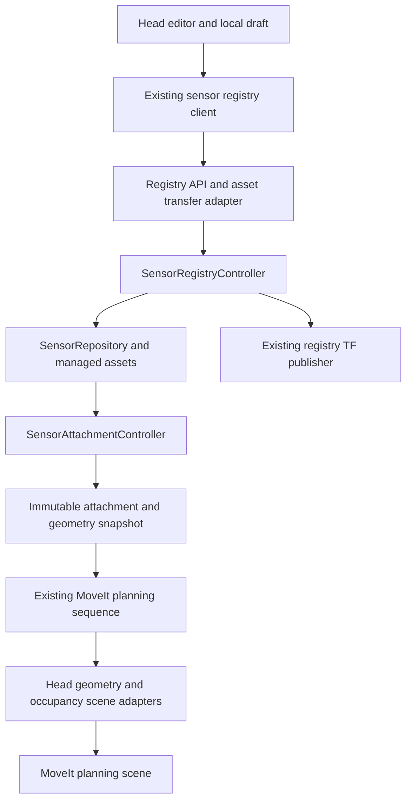

# Spot sensor head editor design

Design status: proposed subproject, 9 October 2026.

Build a small editor inside the existing Spot application. A user imports an STL
or creates a few simple shapes, positions the head at the lower gripper mounting
interface, marks the sensing point and direction, and saves a reusable sensor
definition. The application supplies the probe TF and the active MoveIt collision
geometry. Users do not edit URDF, configure robot joints, or manage ROS frames.

This is a moderate, bounded implementation project. Mesh display and picking have
established library support. The substantial work is a dependable mounting
workflow, replacement of the original jaw geometry, and synchronization between
the saved definition, physical attachment state, TF, and MoveIt.

## Product scope

The first release supports one rigid sensor head replacing a verified portion of
the fixed lower gripper jaw, with one sensing frame per sensor definition. The
rest of Spot is a locked visual reference. The user can orbit the view, but cannot
edit the robot's kinematics, joint limits, or permanent geometry.

Include STL import, explicit unit selection, guided head placement, tip and
direction selection, box and cylinder creation, collision preview, undo and redo,
save and reopen, and integration with the existing sensor registry and attachment
confirmation. Existing acquisition channels remain part of the same definition.

Defer CAD solid modeling, arbitrary robot editing, articulated attachments,
automatic scanning, automatic physical calibration, and multiple independently
moving probes. An optional portable head bundle can support backup and transfer;
normal use ends with **Save head**, without manual folder management.

## User workflow

| Step | User action | Application behavior |
| --- | --- | --- |
| Open | Select **Create head** or **Edit head** | Open a draft with a locked wrist, remaining gripper, and highlighted mounting interface. Provide front, side, top, and perspective views. |
| Import or build | Drop an STL, or choose **Add box** / **Add cylinder** | Display the head in a distinct color. Ask for STL units and show its width, height, and length in millimetres. Primitive dimensions use millimetres. |
| Mount | Choose the supplied lower-jaw template and align the head | Use the template's known mounting datum. Provide guided reference selection for an arbitrary STL and constrained drag handles for adjustment. |
| Mark sensor | Click the sensing point and indicate the sensing face or direction | Show the point and a clear approach arrow. Allow **Flip direction**, roll adjustment, and a measured offset from the picked surface. |
| Review | Inspect the head and collision envelope from several views | Show dimensions, approach arrow, collision coverage, and any unresolved import or placement issue. |
| Save | Give the head a name and select **Save head** | Validate and persist the definition and assets. Publish its existing probe TF through the registry. Saving does not select a physical head. |
| Use | Select the head and confirm it is physically installed | Use the existing attachment workflow. Prepare the matching MoveIt scene before admitting the next plan. |

The default screen needs a 3D viewport, a short step panel, a few dimensions, and
Back, Next, Undo, Reset view, and Save controls. Keep frame names, quaternions,
collision message types, and file paths out of the normal workflow. Advanced
numeric placement remains available for precise adjustment.

### Mounting an arbitrary STL

An STL does not identify its units, mounting interface, or sensing point. Placing
it visually against Spot provides only an estimate. The editor must establish a
physical correspondence before offering a precise snap.

Provide two placement paths:

- **Template coordinates:** a head exported with the supplied mounting datum is
  positioned directly. Display the alignment for confirmation.
- **Guided alignment:** show three ordered, non-collinear reference locations on
  the mounting template and ask the user to select their corresponding locations
  on the imported head. Solve a rigid placement and report alignment mismatch in
  millimetres. Reject degenerate selections and substantial distance mismatch;
  do not silently stretch the head to make it fit. Hole-center or planar-feature
  snapping can improve selection after the basic workflow is proven.

Constrained dragging and numeric offsets refine this placement. Unit conversion
is separate from placement; scaling is disabled on the placement handles. A
head without identifiable mounting references can still be positioned manually,
but the interface must describe that placement as manually configured.

### Selecting the sensing frame

A clicked point supplies position only. Use a selected face or explicit arrow to
define local **+X toward the inspected surface**. Show an explicit flip control;
STL normals alone cannot establish the intended sensing direction.

Choose the remaining orientation from the mounting template's up direction,
projected perpendicular to +X, and expose a simple roll control. Reject a
degenerate up direction and ask the user to choose another reference. Preserve a
right-handed orthonormal frame. For a curved surface, let the user choose the
direction separately rather than depending on one small triangle's normal.

The sensing point may lie ahead of the imported housing. Allow a measured offset
along the approach arrow or numeric adjustment. Selecting the sensing frame must
not translate or rotate the collision geometry.

## Technology choice

Use **Python 3.10, the existing PyQt5 application, and VTK 9.1** as the initial
target stack. Local inspection found Python 3.10.12, PyQt5 5.15.6, Qt 5.15.3,
VTK 9.1.0, and NumPy 1.21.5 available. Treat those as the starting compatibility
baseline; declare the required dependencies and verify deployment packaging.

| Responsibility | Library or API | Reason |
| --- | --- | --- |
| Dialogs, steps, dimensions, undo | Existing PyQt5; `QUndoStack` | Fits the application and avoids another UI runtime. |
| Embedded 3D view | VTK `QVTKRenderWindowInteractor` | Embeds a renderer directly in the Qt event loop. |
| STL and reference mesh loading | `vtkSTLReader`, `vtkOBJReader` | Loads imported heads and existing Spot OBJ reference assets. |
| Surface picking | `vtkCellPicker` | Supplies an actual mesh intersection and its normal; restrict picking to the intended actor. |
| Placement interaction | `vtkBoxWidget2` and `vtkBoxRepresentation`, plus Qt numeric controls | Provides a rigid transform when scaling and face movement are disabled. A polished set of axis handles remains application UI work. |
| Geometry processing | VTK triangle, cleaning, normal, and feature-edge filters | Reuse the same mesh representation for display and structural checks. |
| Pose mathematics | Existing geometry helpers and NumPy | Keep frame rules in the domain layer; use NumPy for alignment fitting. |
| Persistence | Existing YAML repository and atomic writes | Keep one persistent sensor definition and managed mesh assets. |
| Robot integration | Existing `rclpy`, `tf2`, `moveit_msgs`, and `shape_msgs` | Extend the current registry and planning path. |

VTK documents [STL loading](https://vtk.org/doc/nightly/html/classvtkSTLReader.html),
[surface picking](https://vtk.org/doc/nightly/html/classvtkCellPicker.html), and
[Qt embedding](https://docs.vtk.org/en/latest/api/python/vtkmodules/vtkmodules.qt.QVTKRenderWindowInteractor.html).
Use APIs verified against the 9.1 baseline; current online documentation also
contains newer APIs.

Direct VTK avoids adding PyVista, pyvistaqt, or a browser bridge for this small
viewport. Keep rendering behind an adapter so this choice is replaceable.
Trimesh can be considered later for a demonstrated mesh-processing need; it is
not required for the first release. New C++ application code is unnecessary:
VTK performs rendering and mesh operations in its native implementation.

Load the editor's VTK modules on demand. Missing graphics support should disable
the editor with an actionable message while leaving the existing UI available.
Keep rendering on the Qt thread and expensive import/validation work off it;
workers return immutable results rather than modifying rendered actors.

Pick against the original mesh even when display geometry is simplified. Check
pick success before using returned coordinates or normals. VTK's cylinder source
uses local Y as its axis, while ROS collision cylinders use local Z; the rendering
adapter must convert this convention explicitly and have a sign/axis test.
Selecting an entire planar face also needs application logic to group coplanar
STL triangles because an STL contains no CAD face identities.

## Existing architecture and new responsibilities

Extend the existing sensor subsystem rather than create a parallel head registry.



| Owner | Responsibility |
| --- | --- |
| UI under `ui/sensor` | Presentation, picking intent, dimensions, draft editing, undo and preview. No robot commands or direct planning-scene writes. |
| Domain under `inspection/geometry` and `inspection/model` | Unit conversion, rigid alignment, probe-frame construction, geometry validation, and persistent data rules. No Qt, VTK actors, or ROS messages in domain models. |
| `SensorRegistryController` | Validate and save completed definitions under existing mutation guards. |
| `SensorRepository` | Store definitions and managed assets, including revisions and checksums. |
| Registry ROS API and client | Convert typed data, transfer assets, publish definitions and the existing sensor TF. |
| `SensorAttachmentController` | Own physical selection, confirmation, revision, and motion reservations. |
| MoveIt planner and scene adapters | Apply and verify the confirmed head geometry in the existing serialized planning sequence. |

An editor draft is an unsaved document, not a second physical attachment state.
Opening the editor never moves Spot. Any future calibration movement must pass
through CommandController, ROS command transport, the Behavior Tree, and the
existing execution components.

## Frame and data contract

Retain `SensorDefinition.hand_to_probe` as the authoritative persistent probe
pose and `hand -> <sensor_id>_probe` as the public TF. Geometry has its own
placement relative to `hand`. A separate persisted head-to-probe pose must not
compete with the existing hand-to-probe field.

During editing, convert picks from the viewport into the imported geometry frame.
For a head placement `T_hand_geometry` and a picked local frame
`T_geometry_probe`, compute:

```text
T_hand_probe = T_hand_geometry * T_geometry_probe
```

Save the result into `hand_to_probe`. Reconstruct the local marker when reopening
with the inverse head placement. If a draft head is moved, carry its marker with
it and recompute the result; changing only the tip leaves geometry unchanged.
Reuse the existing pose composition and inversion helpers.

Extend the sensor definition with the following conceptual fields. Names are
proposed; final ROS fields should follow the existing message conventions.

| Field | Purpose |
| --- | --- |
| `schema_version` | Distinguish geometry-capable definitions from current definitions. |
| `definition_revision` | Monotonic version for saved definition edits, including geometry changes. |
| `hand_to_probe` | Existing authoritative sensing pose, in metres and a normalized quaternion. |
| `head_geometry.mounting_template_id` and template revision | Identify the verified interface and replaceable jaw configuration. |
| `head_geometry.visual_asset` | Managed normalized mesh reference, content hash, and import-unit provenance. Optional for primitive-only heads. |
| `head_geometry.hand_to_geometry` | Rigid placement of the mesh and its local collision shapes. |
| `head_geometry.collision_shapes` | Boxes, cylinders, or validated triangle meshes with local poses and asset references. |
| `head_geometry.clearance_m` | Explicit requested clearance with a supported geometric realization. |
| `configuration_method` | For example, manual dimensions or CAD alignment. Do not label an unmeasured model as physically calibrated. |

Use metres internally and millimetres in user controls. Store quaternions in the
existing x, y, z, w convention. Freeze the definition revision and collision
content hash in `MotionAttachmentSnapshot` alongside the existing attachment
revision. Both the tip and collision volume must belong to that same snapshot.

### Assets and remote operation

Preserve the current sensor YAML location under
`$ROS_HOME/fault_detector_spot/sensors`. Place normalized meshes in a managed
`assets` subdirectory with content-based identifiers. A definition references
relative managed paths, never the original file in Downloads. Write validated
assets first, then atomically replace the YAML manifest. A failed save leaves the
previous definition usable.

The UI is remote-capable. An STL path on the UI machine cannot be assumed to exist
on the backend. Add bounded asset upload/download at that real ROS boundary,
including content hash, byte count, format, progress, and explicit failure. Use
chunked transfer for assets exceeding the agreed message limit; prototype limits
against the deployed DDS configuration before choosing the final interfaces.
Registry updates carry metadata and asset IDs, not repeated mesh payloads.

The backend supplies the matching mounting-template revision and reference assets
through the same asset boundary. Reject activation against an incompatible robot
model/template version. A save includes the expected definition revision so an
older editor draft cannot overwrite a newer definition silently.

Extend `SensorDefinition.msg`, its adapters, and existing add/update services for
geometry metadata. Transfer assets before submitting the completed definition;
the backend rejects missing assets or hash mismatches. Cache downloaded assets
by hash for reopening drafts and previews. Optional head-bundle import/export
contains the same versioned manifest and assets, with bounded extraction and
paths confined to the bundle.

The application API and execution components also cross a ROS process boundary.
Extend existing command/context transport with the reserved attachment revision,
definition revision, probe pose, and immutable geometry reference where required.
Execution resolves that exact geometry through the registry boundary and its content cache;
it must not infer the installed head from whichever definition or TF arrived last.
Inspect producers, semantic command models, ROS adapters, and execution consumers
together when extending this contract.

## Collision geometry policy

Visual shape and collision shape are distinct representations of the same head.
Show the collision shape as a translucent overlay. Cover the housing, mounting
bracket, and rigid protrusions that travel with the hand, including the probe.

For the first release, use boxes and cylinders directly, and permit a validated
closed STL as a triangle collision mesh within a measured complexity limit. Offer
an enclosing box when a mesh is unsuitable or unnecessarily detailed. Display
that approximation so the user can see the extra occupied volume. Disconnected
parts require separate validated components or a covering primitive envelope.

Do not silently decimate collision meshes: decimation can remove material from
the collision envelope. Display-only simplification is independent. Automatic
convex decomposition and guaranteed mesh offsetting belong to a later phase.

Implement clearance for primitives explicitly: enlarge box dimensions by twice
the margin; enlarge cylinder radius by the margin and length by twice the margin.
An arbitrary triangle mesh initially supports its nominal surface with zero
additional margin, or a conservative primitive envelope with a margin. Disable
unsupported mesh-margin combinations. Do not describe global mesh scaling as a
uniform clearance shell or assume robot-link padding inflates attached objects.

The environment toggle and per-command bypass retain their current semantics:
they change OctoMap collision relationships. Explicit scene objects and normal
self-collision rules remain in force. The new head follows the same policy.
Existing final probing segments continue using the existing occupancy bypass and
execution guard; this subproject does not redesign intended-contact behavior.

The mounting template supplies narrowly defined allowed-contact links. Users do
not need to configure an Allowed Collision Matrix. Do not exempt the head from
the entire robot or automatically ignore the moving finger merely because it is
near the mounting interface.

## Replacing the original jaw in MoveIt

The current `arm_link_wr1` contains permanent wrist collision geometry plus
`front_jaw`, `middle_jaw`, and `jaw_tooth` mesh components. The moving finger is
separate. Identify the exact physically removed part before changing the model;
filenames alone do not establish which components disappear.

The baseline design is an exchangeable jaw slot:

1. Make a one-time robot-model change that separates the verified removable jaw
   from permanent collision geometry. Retain the wrist and remaining finger.
2. Provide the stock jaw as a built-in geometry profile for the confirmed
   no-sensor state. That state means the normal gripper is installed; an exposed
   interface with neither stock jaw nor head needs a separate explicit profile
   if that physical configuration will be supported.
3. Represent the installed stock jaw or sensor head as the single owned
   `AttachedCollisionObject` fixed to the existing `hand` link. Compose source
   meshes through the existing wrist-to-hand transform; do not duplicate its
   offset in the editor.
4. Swap this owned object through planning-scene diffs. Keep unrelated objects
   and collision rules intact. Removal of an old head must not leave it as an
   obstacle in the world.

This uses MoveIt's established
[attached-object and acknowledged scene-update APIs](https://moveit.picknik.ai/humble/doc/examples/planning_scene_ros_api/planning_scene_ros_api_tutorial.html).
The application adds geometry to the planning scene at runtime. It does not
rewrite and reload the complete robot URDF whenever a user saves a head. The
current launch reads the URDF when MoveIt starts; an attached object cannot
subtract collision shapes that remain embedded in that loaded robot model.

The initial model change requires a normal deployment and restart to take effect.
Subsequent head changes use scene updates. The editor reference visuals must
likewise distinguish the removed lip; a combined visual mesh may need one-time
asset preparation. A complete generated URDF is an optional offline export and
must not become a second runtime TF source.

Changes to `spot_moveit_config` are a prerequisite outside the current default
edit scope. Their implementation needs explicit scope authorization. This design
does not authorize deployment, node restarts, or physical validation.

## Activation and synchronization

Keep the distinction between **definition saved**, **physical attachment
confirmed**, and **scene synchronized**. The last is derived integration status,
not a second authority for which head is attached.

Extend the current planner sequence as follows:

1. Obtain a confirmed immutable attachment snapshot, including its definition
   revision, collision hash, and stock/custom geometry. Apply this to every
   MoveIt arm plan, including ordinary hand motions, not only probe commands.
2. Through the existing scene-update sequence, read the owned attached object and
   current collision policy. Compare actual geometry and placement with the
   expected snapshot rather than relying on a local cached “applied” flag.
3. Apply the required head replacement and occupancy policy. Await successful
   completion, then verify the owned scene object before requesting a plan.
4. Recheck the attachment/definition revisions before accepting the plan and
   immediately before dispatch. Keep the reservation effective throughout the
   operation so a head cannot change during execution.
5. On missing geometry, unknown update completion, a changed revision, or a
   MoveIt restart, refuse a new plan until the expected scene is synchronized.
   Startup must install the confirmed stock/custom profile before planning;
   there is no valid planning state with the removable jaw accidentally absent.

Use stable owned object IDs and idempotent updates. Serialize updates through the
existing planner, including cancellation and uncertain service completions. An
activation-triggered scene refresh, if added, uses that same sequence while idle.
External clients that modify the same scene require coordination; this design
does not make concurrent independent scene writers safe.

Preserve existing guards against saving over selected or reserved definitions.
Editing an active head can open a draft or save a new definition, but cannot
silently change the installed configuration. Legacy definitions without geometry
remain readable and editable; require geometry completion before authorizing
geometry-aware MoveIt motion with that physical sensor. Never treat a missing
head model as an empty head.

The registry remains the only publisher of `hand -> <sensor_id>_probe`. Static TF
may remain in listeners after a definition is deleted; presence of that frame
does not prove the head is installed or even still registered. Use registry and
attachment state for admission, and retain the existing static-TF deletion
limitation. Do not introduce a competing URDF or editor TF publisher.

Static TF updates also arrive asynchronously. Existing consumers can retain an
old pose after a definition is edited and the same sensor ID is reselected.
Derive motion geometry from the reserved snapshot's probe pose wherever that
snapshot is available. Any remaining TF-based consumer must verify that its
hand-to-probe transform agrees with the reserved pose before admitting motion.
Matching attachment and scene revisions alone does not establish TF readiness.

## Accuracy and operating limits

The saved transform is a geometric configuration. Its physical accuracy depends
on STL scale, mounting references, manufacturing tolerances, assembly play, and
selection accuracy. Do not promise millimetre physical accuracy from a mouse
click. Show alignment residual and entered dimensions, but do not present fitting
residual as absolute calibration accuracy. Physical calibration can later refine
the existing probe pose without moving the collision envelope.

The current occupancy map uses 5 cm voxels. Its sensing-mask padding is a separate
quantity from collision clearance. Verify attached-body self-filtering and stale
occupancy behavior before claiming complete integration; excessive filtering can
also hide nearby real obstacles.

The current native stow and preparation paths bypass MoveIt. Adding a head to the
planning scene therefore does not automatically protect those paths or provide
continuous runtime avoidance. Inventory them during implementation. A custom
head must not be advertised as supported for an unvalidated native motion;
gate that operation or supply an explicitly approved, separately validated
alternative before release. Keep existing execution guards intact.

## Delivery stages and acceptance

| Stage | Deliverable | Acceptance |
| --- | --- | --- |
| 1 Reference and library prototype | Fixed hand preview, one actual STL, units, surface picking, and marker orientation | Works with the deployed Qt/VTK versions without starting ROS nodes. Identify the real removable jaw and mounting references. |
| 2 Offline editor | Guided alignment, primitives, collision overlay, undo, save and reopen | A novice completes one representative head using only the guided UI. Repeat reopening preserves placement and the sensing frame. |
| 3 Registry integration | Versioned definitions, managed assets, remote transfer, existing TF publication | Save/reopen works across separate UI/backend filesystems; failed transfer/save preserves the previous definition. |
| 4 MoveIt integration | Approved jaw-slot model change, stock/custom scene synchronization, attachment gating | Isolated scene tests cover swaps, collision policy, failures, cancellation, and stale revisions. No live robot required. |
| 5 Release validation | Novice usability session and approved physical checks | Verify mounting repeatability, tip placement, collision coverage, sensing mask, and allowed motion modes on the real configuration. |

Set performance limits during Stage 1 using representative files: maximum upload
size, visual and collision triangle counts, import memory, and viewport response.
Reject oversized files with a useful explanation or offer an enclosing primitive.
Do not make an unmeasured latency or arbitrary mesh-complexity promise part of the
interface contract.

Meaningful offline regression checks include:

- Unit conversion and non-identity transform round trips through import, editor,
  persistence, TF conversion, and MoveIt geometry. Cover +X direction, roll, and
  rotated/translated meshes, including VTK versus ROS cylinder axes.
- Alignment from known correspondences, degenerate selections, flipped normal
  correction, off-surface tip offsets, and geometry remaining fixed after a tip
  adjustment.
- Invalid/empty meshes, non-finite vertices, degenerate triangles, invalid
  topology for collision use, missing assets, and mismatched content hashes.
- Mismatched template/model revisions and a stale TF buffer after editing and
  reselecting the same sensor ID.
- Stock geometry restoration, removal of only the verified jaw components,
  selective mounting contacts, and a configuration where the head hits the
  forearm or an obstacle while the bare hand would fit.
- Ordinary and Cartesian planning with the existing occupancy toggle and
  bypasses, missing scene objects, MoveIt restart, late apply responses, and
  attachment changes during planning or execution admission.
- Existing sensor registry, attachment reservations, acquisition channels, and
  probe-geometry contracts continuing to behave as before.

## Repository integration references

- [Sensor model](../fault_detector_spot/inspection/model/sensor_models.py),
  [sensor repository](../fault_detector_spot/inspection/repository/sensor_repository.py),
  and [sensor registry controller](../fault_detector_spot/application/controllers/sensor_registry_controller.py).
- [Registry API and TF owner](../fault_detector_spot/application/api/sensor_registry_api.py),
  [attachment authority](../fault_detector_spot/application/controllers/sensor_attachment_controller.py),
  and [remote registry client](../fault_detector_spot/ui/ros/sensor_registry_client.py).
- [Pose composition](../fault_detector_spot/inspection/geometry/pose.py),
  [MoveIt planner](../fault_detector_spot/manipulation/moveit_arm_planner.py),
  [scene adapter](../fault_detector_spot/manipulation/moveit_collision_scene.py),
  and [collision policy](../fault_detector_spot/manipulation/moveit_collision_policy.py).
- [Existing collision implementation plan](MoveIt_Collision_Avoidance_Implementation_Plan.md),
  [Spot robot model](../../spot_moveit_config/config/spot.urdf), and
  [MoveIt launch](../../spot_moveit_config/launch/move_group.launch.py).
