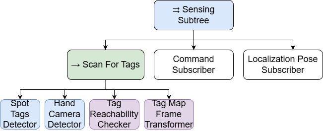
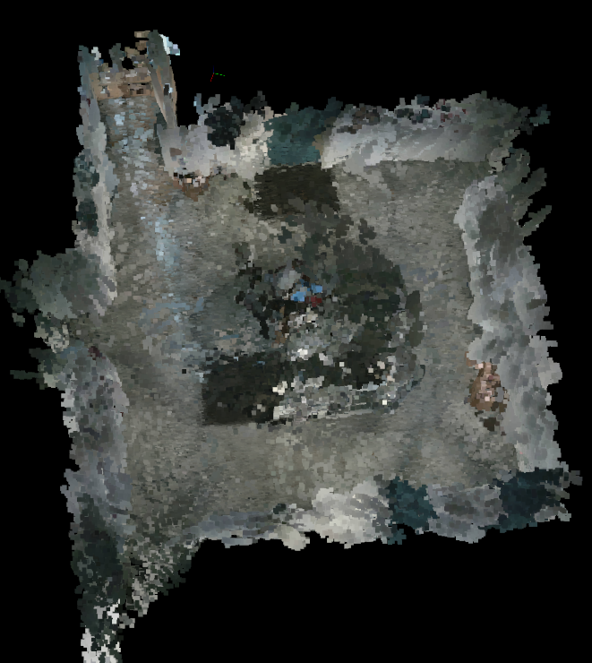
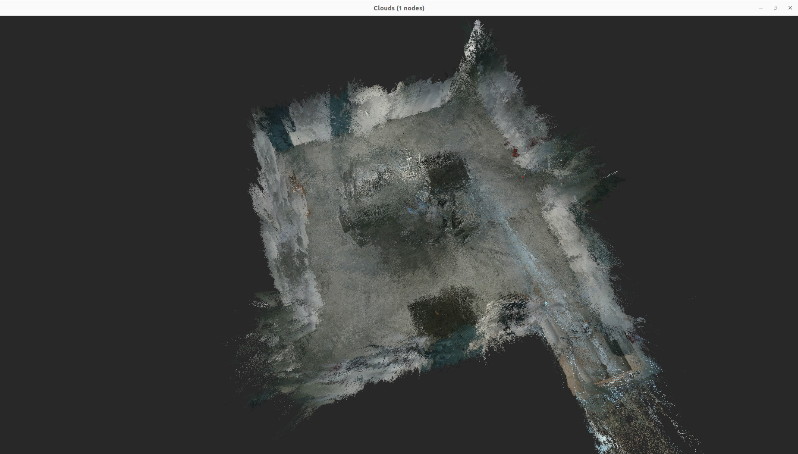

# System Design Document

GENERAL CONCEPT OF THIS DOCUMENT

INHALTSANGABE

## General Architecture

The Systems architecture follows the principles of modularity, reusability, and transparency. Each subsystem, navigation, manipulation, data acquisition, and
user
interaction, can operate independently while being orchestrated through a shared behavioural control layer.

At the center of the architecture is the behaviour tree (BT), which functions as the system’s control and coordination core.  
It continuously monitors incoming commands and system states, deciding which behaviour to execute at any given time.  
The tree integrates sensing, decision-making, and action execution into a single hierarchical control structure.

Incoming user commands are received and buffered, after which the BT interprets their intent and delegates them to the corresponding behavioural
branch.  
Each branch encapsulates a distinct capability of the robot, such as navigation, manipulation, or mapping, and defines the logical sequence of steps required to
complete that task.

This approach places all high-level decision logic inside the BT itself, allowing it to directly coordinate perception, motion, and feedback
processes without external supervisory nodes.  
It also ensures that each command is executed deterministically, with built-in handling for cancellation, error conditions, and feedback publication.

The result is a modular yet unified control structure: new behaviours can be introduced by extending the tree with additional branches, while the communication
and data exchange between components remain standardized through ROS 2 topics, services, and the shared blackboard.

An architectural overview is provided as a diagram all behaviour tree and system architecture diagrams were created using [Draw.io](https://app.diagrams.net/).


*Figure: High-level software architecture of the ROS2 system developed.*

---

# Main System Components and Features

The following section provides a concise overview of the system’s main components as illustrated in the architectural diagram above.
It outlines the functional purpose of each major subsystem and explains how they interact within the overall control structure.
This section serves as an overview of the high-level architecture. The subsequent Detailed System Design elaborates on implementation details, data
handling, and internal logic.

## Behaviour Tree Execution Layer

The behaviour tree (BT) constitutes the logical center of the system.  
It defines the robot’s operational logic as a dynamic hierarchy of nodes, including conditions, actions, and control structures such as selectors and
sequences.  
This approach was chosen over traditional finite state machines to improve scalability, readability, and runtime flexibility.

Within the BT, sensor data and system states are continuously written to a shared blackboard, which acts as the central data exchange layer.  
All decision-making and command execution are based on this shared context.

The BT also incorporates a command-handling branch, which processes incoming commands in a first-in, first-out (FIFO) buffer to ensure sequential execution and
prevent conflicts.  
Each command is interpreted by the BT and mapped to its corresponding behaviour subtree, which encapsulates the logical steps required to achieve the requested
action.

This modular and message-driven structure allows the system to:

- React to external inputs in real time.
- Integrate new actions without modifying core logic.
- Maintain synchronized state feedback across all subsystems

## System Components

### 1. User Interface (UI)

The User Interface provides the main entry point for system control and monitoring. It allows the user to:

- Send commands (e.g., manipulator goals, navigation goals, scanning sequences).
- Manage recorded command sequences.
- View system state, queue contents, and behaviour execution status in real time.

All commands issued via the UI use the same communication pathway as recorded test commands, ensuring consistent handling between manual and autonomous
operation.

The UI is implemented as a loosely coupled subsystem with a focus on modularity, expandability, and testability. Its primary purpose is to support experimental
development and automated testing, rather than polished end-user usability. It can be replaced by a simplified operator interface or integrated with an
automated control agent without structural changes to the rest of the system.


*Figure: Graphical user interface of the Fault Detector Spot system, showing status overview, emergency stop, and tabs for manipulation, base movement,
navigation, and recording control.*

### 2. Spot ROS 2 Driver Integration

The system interfaces with the Boston Dynamics Spot robot through the official [Spot ROS 2 driver](https://github.com/boston-dynamics/spot_ros2), which bridges
the Spot SDK into the ROS 2 ecosystem.  
The driver exposes major robot capabilities as ROS 2 topics, services, and actions, enabling external control and monitoring without directly using the Spot
SDK.

The integrated driver (Spot SDK **v5.0.1**) provides access to:

- Base and arm motion control
- Gripper actuation (open/close, force control)
- Camera image and depth streams
- Localization and state feedback
- Power and lease management
- Autonomous mobility and obstacle avoidance

All navigation, manipulation, and gripper commands issued by the system are ultimately executed via this driver.  
Spot’s onboard controllers retain responsibility for balance, terrain adaptation, and obstacle avoidance, so the system can focus on high-level behaviour
coordination while relying on the robot’s built-in safety features.

---

### 3. Command and Control

The command subtree maps incoming commands to their corresponding execution sequences.  
Within the behaviour tree, it serves as the decision layer that activates navigation, manipulation, and system management behaviours.  
Each low-level command is mapped to a dedicated subtree, maintaining separation of concerns and enabling isolated testing.

#### 3.1 Navigation Control

Navigation commands control the Spot base, manage maps, and maintain localization.  
They build on the ROS 2 navigation stack `nav2`, `rtabmap_ros` and the Spot ROS 2 driver, combining autonomous motion planning with Spot’s internal safety
systems.

Key capabilities:

- **Mapping and Map Navigation**
    - Create new maps using SLAM (`rtabmap_ros`) from Spot’s odometry and vision.
    - Save and load maps to enable re-localization in known environments.
    - Manage waypoints (define, name, store) as navigation targets.
    - Plan collision-free paths between waypoints or user-defined goals via `nav2`.

- **Base Control**
    - Execute high-level base motions (stand, walk, rotate) via the Spot driver.
    - Preserve Spot’s native safety (obstacle avoidance, balance, gait control) by sending target poses rather than low-level leg commands.
    - Support motion relative to the robot’s frame or to detected markers (e.g., AprilTags) for precise positioning and alignment.

This layered approach provides high-level navigation planning in ROS 2 while preserving Spot’s built-in mobility and safety behaviour.

#### 3.2 Manipulation Control

Manipulation commands operate the Spot Arm and attached sensor head.  
Using ROS 2 motion planning tools, the system supports both Cartesian and joint-space motions for scanning and interaction tasks.

Commanded poses can be specified:

- As relative motions, or
- With respect to detected markers (AprilTags).

### 3.3 Emergency Stop

A software-level emergency stop mechanism is integrated into the behaviour tree.  
A blackboard flag is monitored continuously; when triggered, the system:

- Cancels all ongoing actions,
- Stops base motion and mapping activities, and
- Stows the manipulator.

This ensures safety overrides can take effect at any point in the command sequence.

---

### 4. Sensing and Input

The sensing subsystem forms one of the main branches of the behaviour tree alongside command execution and feedback publishing.  
It continuously gathers environmental and system state information and writes the results to the shared blackboard.

The sensing branch runs multiple non-blocking tasks in parallel, including:

- AprilTag-based perception using both body-mounted and arm-mounted cameras.
- Transformation of detected tag poses into the global/world frame.
- Subscription to localization and state updates from the mapping subsystem.
- Monitoring of new incoming commands from the command subscriber.

All sensing data are published to the blackboard for access by other components, ensuring that navigation, manipulation, and feedback behaviours operate on a
consistent, up-to-date view of the environment.

### 5. System State and Feedback

The Feedback Subtree provides a continuous stream of system-state information to the user interface and external monitoring tools.
It operates in parallel to command execution and sensing, ensuring the operator always receives up-to-date information without affecting ongoing behaviours.

**Main responsibilities:**

- **Visible Tags**  
  Publishes the AprilTags currently detected by the robot.

- **Reachable Tags**  
  Publishes the subset of visible tags that can be reached by the manipulator.

- **Command Buffer State**  
  Publishes the list of queued commands awaiting execution.

- **Command Execution Status**  
  Publishes the current state of the command subtree (e.g., active, running, failed).

The feedback subsystem provides a unified, non-blocking view of the system’s internal state, enabling reliable operator awareness and quick responses to errors
or unexpected conditions.

### 6. Command Recording and Playback

The **Recording and Playback subsystem** provides the ability to capture and reproduce command sequences.  
All commands sent through the system are timestamped and logged, allowing them to be replayed later using the exact same execution pathway as live operation.

**Main capabilities:**

- **Start Recording**  
  Begins logging all incoming commands.

- **Stop Recording**  
  Finalizes and stores the recorded sequence.

- **Play Recording**  
  Replays a previously saved command sequence for testing or demonstration.

This functionality enables repeatable test runs, regression testing, and automated inspection routines without additional programming, effectively turning the
system into a scriptable robotic test platform.

### 7. System Startup and Launch

The core ROS 2 nodes of the Fault Detector Spot system are started using a unified launch file:

- **Launch file:** [`launch/fault_detector_launch.py`](..%2Flaunch%2Ffault_detector_launch.py)
- **Main nodes started:**
    - `fault_detector_ui` (User Interface)
    - `bt_runner` (behaviour tree execution node)
    - `apriltag_node` (AprilTag perception via `apriltag_ros`)
    - `record_manager` (command recording and playback)

This launch file can be invoked, for example, with:

```
ros2 launch fault_detector_spot fault_detector_launch.py
```

---

## Data Flow Summary

1. **External Input (UI / API)** → Publishes a command to the system topic.
2. **Command Subscriber** → Queues and validates incoming commands.
3. **Behaviour Tree Execution** → Maps command ID to subtree and executes associated behaviour.
4. **Subsystem Nodes** (Navigation, Manipulation) → Carry out low-level control.
5. **Blackboard** → Stores sensor data, intermediate results, and execution state.
6. **Feedback Publishing** → UI continuously receives updates for visualization.

This data-driven, modular organization ensures a clear separation of responsibilities while maintaining robust synchronization across components.

---

## Design Rationale

- **ROS 2 Integration:**  
  ROS 2 provides distributed communication via topics, services, and actions, enabling flexible orchestration between Spot’s hardware interfaces and custom
  behaviour logic.

- **Behaviour Trees over Finite State Machine:**  
  Behaviour trees offer a hierarchical and reactive control framework, simplifying parallel behaviours, condition checking, and command prioritization.

- **Centralized Blackboard:**  
  The blackboard serves as a single source of truth for shared data, reducing inter-node dependencies and easing debugging.

- **Record & Playback:**  
  Enables repeatable testing, benchmarking, and demonstration of inspection routines, which is critical in research contexts and aligns with project
  deliverables defined in the Requirements Specification.

---
Overall the system’s modular design enables seamless interaction between autonomous decision-making and manual control while remaining flexible for future
sensor integration and algorithmic extensions.  
Each subsystem can operate independently or as part of the full execution pipeline, ensuring both scalability and maintainability core design goals stated in
the Requirements Specification.

# Detailed Behaviour Tree Design

This section explains how each part of the system is implemented and interacts internally, bridging the gap between high-level architecture and operational
behaviour. It focuses on subsystems, internal data handling, software dependencies, and execution logic.

<details>
  <summary><strong>Note on Nodes (click to expand)</strong></summary>

> In this section, "nodes" refer to behaviour tree nodes, which are logical elements  
> of the behaviour tree (actions, conditions, and control-flow structures).  
> They are distinct from ROS 2 nodes, which are the software processes that  
> implement the system’s functionality and communicate via topics,  
> services, or actions.

</details>

In a typical ROS 2 + py_trees setup:

- The behaviour tree is hosted within a single ROS 2 node.
- Each tree-node is a Python object and may:
    - Publish or subscribe to ROS 2 topics
    - Call ROS 2 services
    - Use ROS 2 timers
- All tree-nodes execute within the context of the host ROS 2 node, meaning they share the same process and runtime environment.

The following subsections describe the custom components and their interactions that form the developed control system.  
However, the design and internal functionality of major third-party components such as **spot_ros2**, **apriltag_ros**, **nav2**, and **rtabmap_ros** are not
explained in detail here, as each of these frameworks provides its own comprehensive documentation authored and maintained by their respective creators.  
References to these original sources are provided in the [**References**](#10-sources-and-references) section at the end of this document.

This section therefore focuses on the integration logic, the data flow between components, and how the system builds upon these established frameworks to
achieve coordinated control, perception, and feedback.

## 1. Interface Summary

This section summarizes the main ROS 2 interfaces exposed by the system for user interfaces, automated agents, and test tools.  
For full message structures and per-command details, see the separate [interface reference document](interface_reference_document.md).

### 1.1 Command Input

All external control is expressed as `fault_detector_msgs/ComplexCommand` messages.

| Purpose             | Topic                                     | Type                                 | Direction          |
|---------------------|-------------------------------------------|--------------------------------------|--------------------|
| Command input (all) | `fault_detector/commands/complex_command` | `fault_detector_msgs/ComplexCommand` | UI / external → BT |

Key idea:

- `ComplexCommand.command.command_id` selects the behaviour (one of the `CommandID` values).
- Optional fields (`tag`, `offset`, `map_name`, `waypoint_name`, `wait_time`) provide context for that command.

### 1.2 State and Feedback Output

| Purpose                 | Topic                                 | Type                                  | Direction       |
|-------------------------|---------------------------------------|---------------------------------------|-----------------|
| Visible AprilTags       | `fault_detector/state/visible_tags`   | `fault_detector_msgs/TagElementArray` | BT → UI / tools |
| Reachable AprilTags     | `fault_detector/state/reachable_tags` | `fault_detector_msgs/TagElementArray` | BT → UI / tools |
| Command buffer contents | `fault_detector/command_buffer`       | `std_msgs/String`                     | BT → UI / tools |
| Command tree status     | `fault_detector/command_tree_status`  | `std_msgs/String`                     | BT → UI / tools |

### 1.3 Mapping, Navigation, and Recording

| Purpose           | Topic                            | Type                                       | Direction             |
|-------------------|----------------------------------|--------------------------------------------|-----------------------|
| Active map name   | `/active_map`                    | `std_msgs/String`                          | Mapping → UI / tools  |
| Available maps    | `/map_list`                      | `fault_detector_msgs/StringArray`          | Mapping → UI / tools  |
| Waypoints         | `/waypoint_list`                 | `fault_detector_msgs/StringArray`          | Mapping → UI / tools  |
| Landmarks         | `/landmark_list`                 | `fault_detector_msgs/StringArray`          | Mapping → UI / tools  |
| Recording control | `fault_detector/record_control`  | `fault_detector_msgs/CommandRecordControl` | UI / tools → recorder |
| Recordings list   | `fault_detector/recordings_list` | `fault_detector_msgs/StringArray`          | Recorder → UI / tools |

Commands for mapping, navigation, and recording are sent via `fault_detector/commands/complex_command` using the appropriate `command_id` (
e.g. `CREATE_MAP`, `SWAP_MAP`, `MOVE_TO_WAYPOINT`, `ADD_TAG_AS_LANDMARK`, `START_SLAM`, `START_LOCALIZATION`) and associated
fields (`map_name`, `waypoint_name`, `tag`, `wait_time`).

## 2. Behaviour Tree Implementation

The behaviour of the system is organized and executed through a hierarchical behaviour tree (BT) implemented with the `py_trees` and `py_trees_ros` frameworks.
This approach provides modularity, scalability, and clarity in defining complex robot behaviours by composing them from smaller, reusable building blocks.

The main entry point of the behaviour tree is defined in the `bt_runner.py` file. The system runs as a single ROS 2 node (`bt_driver`), hosting the entire tree.
Within this node, individual tree-nodes (actions, checks, and control structures) are defined as Python objects that interact with the rest of the ROS 2 system
through topics, services, and actions.

The root node of the tree is a **Parallel** composite titled `"FaultDetectorSpot"`, which contains three major subtrees:

- **Sensing Tree**
- **Buffered Command Tree**
- **Publisher Tree**

Each of these serves a distinct purpose in the overall data and control flow.
The separation into three subtrees is used for clarity and modularity:

- The **Sensing Tree** handles all inputs into the system whether sensor readings, localization data, or user commands.
- The **Buffered Command Tree** manages decision-making and action execution based on these inputs.
- The **Publisher Tree** ensures consistent outward communication of system states and updates.

This division mirrors the natural flow of information through the system, from perception to decision to communication, allowing each subsystem to operate
independently while remaining synchronized through shared blackboard variables and ROS 2 communication channels.

The Subtree structure can be seen in the diagram built using [draw.io](https://www.drawio.com/) below, with notation adapted
from [Behaviour Trees in Robotics and AI](https://arxiv.org/abs/1709.00084): An
Introduction by Michele Colledanchise &
Petter Ögren. This notation will be used consistently in the following chapters to illustrate each subtree in more detail.

<details>
  <summary><strong>Note on Selector (click to expand)</strong></summary>

> The `py_trees` `Selector` node used in the implementation is slightly different from the classical Fallback node in the source. In `py_trees`,
> a `Selector` can optionally maintain memory of the last running child (with `memory=True`) and will resume from that child on subsequent ticks, whereas the
> standard Fallback always evaluates children from left to right on every tick. In the current system, this memory feature is **not utilized**, so
> the `Selector`
> behaves effectively like a classical Fallback node.
</details>


*Figure: The general behaviour tree structure and its division into three subtrees.*

## 3. Command Handling

The command-handling system defines how external input, such as user interface actions or automated test sequences, is received, interpreted, and transformed
into behaviour tree-compatible actions.

A *command* represents an instruction for the system to perform a specific operation, such as moving the robot base, manipulating the arm, or executing a
scanning procedure. These commands can be broadly divided into two categories: **Basic Commands** and **Complex Commands**.

Basic Commands are minimal instructions that only contain a command identifier. They represent discrete, self-contained operations like starting or stopping a
behaviour, toggling a component state, or triggering an emergency stop. Complex Commands, in contrast, can carry additional contextual information. This may
include spatial offsets, tag references, orientation modes, timing parameters, or mapping context. Complex commands enable parameterized control and are
represented by separate ROS 2 message types that expand on the `BasicCommand` structure.

Although multiple specialized message types could have been defined for each command variation, this approach was intentionally avoided. While having distinct
message definitions would provide stronger type safety, it would also increase the development effort required when introducing new command types. The chosen
design enables flexibility and rapid extension. Once the final command set is known, this trade-off
may be reconsidered, as the high modularity of the system enables swapping out the command handler without altering individual commands.

Incoming commands are handled by the **CommandSubscriber** behaviour tree node. This node subscribes to two custom ROS 2 topics found in
the [fault_detector_msgs package](https://github.com/heini208/fault_detector_msgs): one for basic commands and one
for complex commands. Both types are queued internally upon reception, time-sorted, and then converted into internal command objects. These are appended
to a command buffer on the system’s blackboard, where they can be accessed by other tree components responsible for execution.

#### 3.1 The Command Subscriber

The [CommandSubscriber](..%2Ffault_detector_spot%2Fbehaviour_tree%2Fnodes%2Fsensing%2Fcommand_subscriber.py) is a node from the Sensing Subtree. It
distinguishes between commands by inspecting their message type and the `command_id` parameter.  
The mapping from command identifiers to executable command objects is handled through builder functions. Each recognized command ID has a corresponding handler
that defines how it should be instantiated. This modular structure ensures that new commands can be integrated with minimal modification to the core system.

This version of the system also includes generic command handlers that map commands without their own class to a composite `generic_complex_command` type or, in
the case of basic commands, to simple command objects.  
The existence of a generic command class is primarily intended to enable quick prototyping of new command ideas. Ideally, every command would eventually have
its own command class and a dedicated subscriber handler to avoid fetching unnecessary parameters, increase type safety, and reduce the risk of errors from
handling unknown or partially defined commands.

The command subscriber also demonstrates how certain commands can be combinations of other commands. Combination commands are `commandID`s that represent
sequences of multiple low-level commands. The subscriber parses these messages and appends ordered sets of executable sub-commands to the buffer. For example, a
combination command might instruct the arm to move to a tag position, wait for a specific duration, and then return to a stowed pose. This sequence is
automatically generated inside the subscriber based on the contextual information contained in the incoming message.

Commands may include references to specific AprilTags, positional offsets, or predefined waypoints. This enables context-aware motion such as moving relative to
the robot’s current position, aligning to a marker, or executing actions in relation to known spatial features.

Finally, the command-handling layer integrates safety logic. Emergency-stop commands are recognized at any time and immediately clear the command buffer, halt
ongoing activity, and trigger the system’s stop routines. This ensures that user- or system-level interruptions are reliably enforced regardless of the current
execution state.

Through this structure, the command-handling subsystem forms the interface between high-level user or test input and the low-level behaviour execution tree. It
abstracts the input modality, manages command sequencing, and maintains extensibility while preserving consistent execution semantics.

A detailed command reference table is provided later in this document.  
For extended per-command explanations, refer to the dedicated [**Command Reference Document**](detailed_command_descriptions.md), which contains argument
structures, parameter options, and example
use cases.

<details>
  <summary><strong>Note on limitation (click to expand)</strong></summary>

> The system presently uses separate ROS 2 subscribers for Basic Commands and Complex Commands, even though both forward incoming messages into the same
> callback and unified processing pipeline. When commands of both types are published in quick succession, for example in recorded playback scenarios, their
> relative order may occasionally become inconsistent. This has so far only been observed during recorded message replay but not during live operation.
>
> As a temporary workaround, all Basic Commands can be encapsulated within Complex Command messages. This ensures that the full sequence of operations is
> received through a single subscriber path and therefore preserves ordering.  
> This limitation will be resolved once the Basic Command type is either removed or merged into a unified command structure.
</details>

**Design rationale:**  
Centralizing all external inputs into a uniform command abstraction allows the Behaviour Tree to remain independent of the concrete source (UI, recordings,
automated agents). The internal command objects and buffer provide a single place to implement sequencing, cancellation, and safety policies, while the message
types remain flexible enough to evolve with the command set.

### 3.2 Buffered Command Subtree

#### 3.2.1 Command Execution Flow

Once commands have been received, validated, and converted into their internal representations by the CommandSubscriber node, they are placed into a shared
command buffer on the system’s blackboard. At this point the command-handling layer has completed its responsibility: commands are normalized, ordered, and
ready for execution, but not yet acted upon.

The actual execution and life-cycle management of these command objects is handled by a dedicated subtree inside the behaviour tree: the **Command Buffer
Handler
**.  
This subsystem continuously monitors the command buffer, selects the next executable command, and invokes the appropriate action nodes responsible for base
movement, manipulation, mapping, recording, or other high-level functions.

The next section describes how the Command Buffer Handler operates, how command classes transition from buffered objects to active behaviours, and how execution
flow, cancellation, and completion states are coordinated. It also includes a summary of all currently available command types integrated into the system.

The Buffered Command Tree manages and executes user commands in a controlled, buffered manner. Commands received from the UI are stored, queued, and processed
one at a time. This design ensures that actions do not overlap and that the robot maintains a predictable execution flow.

The main structure includes:

- **CommandManager:** Acts as a command buffer, storing and managing incoming commands.
- **NewCommandGuard:** Ensures that only new commands trigger execution and that they can be safely interrupted.
- **Emergency Sequence:** Cancel Sequence Command that stops all robot movements.
- **Command Selector:** Selects the corresponding behaviour for each command ID popped from the buffer.
- **EmergencyGuard:** Enables cancellation of running commands through the estop_flag blackboard variable.
- **Command Execution Nodes:** Behaviours responsible for handling the execution of commands

Each supported command, such as `MOVE_ARM_TO_TAG`, `START_SLAM`, or `DELETE_MAP` is represented by a corresponding behaviour or subtree that defines its logic
and
interactions with the rest of the system.

The buffered command subtree is visualized in the following behaviour tree diagram:


*Figure: The Buffered Command Subtree. Shows the command buffer, guards, emergency paths, and selector logic.*

#### 3.2.2 CommandManager

The [CommandManager](..%2Ffault_detector_spot%2Fbehaviour_tree%2Fnodes%2Futility%2Fcommand_manager.py) is responsible for buffering incoming commands and
dispatching them to the command execution tree in a controlled manner. Its main functions are:

- **FIFO Dispatch**: When the command tree is idle (i.e., not `RUNNING`), the oldest command is popped from the buffer and written to `blackboard.last_command`.
- **Emergency Handling**: If an `EMERGENCY_CANCEL` command is found anywhere in the buffer, it is immediately promoted to `last_command` and the buffer is
  cleared. This ensures that emergency stops are enforced reliably.
- **Failure Handling**: Optionally, commands that fail (`FAILED` status) can trigger buffer clearing to prevent the execution of outdated or conflicting
  commands.

#### 3.2.3 NewCommandGuard

The [NewCommandGuard](..%2Ffault_detector_spot%2Fbehaviour_tree%2Fnodes%2Futility%2Fnew_command_guard.py) ensures that each command is processed exactly once,
avoiding duplicate execution:

- **Timestamp Check:** Compares the timestamp of `last_command` with `last_processed_command`.
- **Activation Control:** Only allows the guarded command sequence to execute if a new command is detected.
- **Duplicate Prevention:** Prevents repeated executions of the same command.

#### 3.2.4 EmergencyGuard and Emergency Sequence

Because the CommandManager cannot terminate nodes directly, the EmergencyGuard decorator wraps a command sequence and immediately cancels it if an
emergency flag is set:

- **Immediate Emergency Handling:** Enables immediate execution of `EMERGENCY_CANCEL` sequences by canceling currently running commands.
- **Safe Stop:** Ensures the robot can safely stop any ongoing action regardless of current command execution.

#### 3.2.5 Command Selector

The **Command Selector** is the core node in the behaviour tree responsible for choosing and executing the correct command based on the current `last_command`
from the blackboard.

Key points:

- Implemented as a `py_trees.composites.Selector` that **checks each command ID** and runs the corresponding behaviour sequence.
- Wraps each command in a **guarded sequence** that first verifies the blackboard variable `last_command` matches the command ID.
- Handles both **Spot actions** (via `ActionClientBehaviour` / `SimpleSpotAction`) and **non-robot commands** (navigation, mapping, or state updates).
- Integrated with **emergency cancellation** via a higher-level `CancelableCommandSelector` that prioritizes emergency stop sequences over normal commands.
- Supports **preprocessing and helper logic**, e.g., fetching target poses, checking tag visibility, or computing SLAM-related goals before executing the
  command.
- Modular: Adding a new command only requires defining its behaviour sequence and registering it in the selector.

### 3.3 Command Behaviour Execution Nodes

When adding a new command to the tree, each command is automatically wrapped with a Command ID checker by a helper class. Each command needs this checker for
the
Command Selector to ensure that the correct subtree or action sequence is executed for the currently active command stored on the blackboard.

**Executors of commands** can be broadly divided into two categories based on how they interact with the robot:

#### 3.3.1 Action Client Behaviours [(`ActionClientBehaviour` / `SimpleSpotAction`)](..%2Ffault_detector_spot%2Fbehaviour_tree%2Fnodes%2Futility%2Fspot_action.py)

These executors communicate **directly with the robot via the Spots ROS2 drivers `RobotCommand` action**. They handle asynchronous action sending, monitoring,
and cancellation.

**Characteristics:**

- Inherit from **`ActionClientBehaviour`** (custom Spot action lifecycle) or **`SimpleSpotAction`** (Spot-specific `RobotCommand` helper).
- **Lifecycle Management:** Handles initialization, goal sending, result polling, and cleanup automatically.
- **Emergency Handling:** Can cancel ongoing goals immediately if an emergency is triggered.
- **Blackboard Integration:** Reads the current command from the py_trees blackboard set by the command manager (`last_command`) to set necessary parameters.
- **Extensible:** Subclasses must implement:
    - `_build_goal() → Goal`: Construct the goal message.
- **Optional Overrides:** The following methods have default implementations in the base class and **do not need to be implemented by most subclasses**. Only
  override if special logic is required:
    - `_init_client() → bool`: Initialize the specific action client.
    - `_send_goal(goal) → Future`: Send the goal via the action client.
- **Spot-Specific Variant:** `SimpleSpotAction` wraps Spot's `RobotCommand` action, providing helpers to simplify sending robot-specific commands.
- **Examples of Subclasses:**
    - `StowArmActionSimple`
    - `ReadyArmActionSimple`
    - `CloseGripperAction`
    - `ManipulatorMoveArmAction`
    - `ManipulatorMoveRelativeAction`
    - `BaseMoveToTagAction`

#### 3.3.2 Other Commands (`py_trees.behaviour.Behaviour`)

Some commands do **not** use the ROS2 `RobotCommand` action driver. Instead, they interact with:

- **Mapping or SLAM** (e.g., RTAB-Map)
- **Navigation** (e.g., Nav2)
- **Information flow** or **blackboard state**

**Key Points**

- Inherit directly from `py_trees.behaviour.Behaviour`.
- Implement `update()` to define their specific logic.
- May read from and/or write to blackboard variables.
- Communicate via **topics**, **services**, or **helper classes**, rather than `RobotCommand` actions.

**Examples**

- `DeleteWaypoint`: removes a waypoint from the map.
- `NavigateToGoalPose`: sends a goal to Nav2.
- `ManipulatorGetGoalTag`: fetches a visible goal tag.

### 3.4 Available Commands

Below is a list of all currently available commands and their respective behaviours. Each command is referenced via its `CommandID` from
the [command_ids.py](..%2Ffault_detector_spot%2Fbehaviour_tree%2Fcommands%2Fcommand_ids.py) file. The table shows the mapping from command IDs to the
corresponding behaviour sequences.

The exact functionality of each command will become clear either:

- In the dedicated section describing the corresponding subsystem, or
- By reading the detailed explanation in the [Command Reference Document](detailed_command_descriptions.md) that provides argument structures, parameter
  options, and example use cases for each
  command.

| CommandID                     | behaviour Sequence                                                                                                                                                                                                                                      |
|-------------------------------|---------------------------------------------------------------------------------------------------------------------------------------------------------------------------------------------------------------------------------------------------------|
| STOW_ARM                      | [StowArmActionSimple](..%2Ffault_detector_spot%2Fbehaviour_tree%2Fnodes%2Fmanipulation%2Fstow_arm_action.py)                                                                                                                                            |
| READY_ARM                     | [ReadyArmActionSimple](..%2Ffault_detector_spot%2Fbehaviour_tree%2Fnodes%2Fmanipulation%2Fready_arm_action.py)                                                                                                                                          |
| TOGGLE_GRIPPER                | [ToggleGripperAction](..%2Ffault_detector_spot%2Fbehaviour_tree%2Fnodes%2Fmanipulation%2Ftoggle_gripper_action.py)                                                                                                                                      |
| CLOSE_GRIPPER                 | [CloseGripperAction](..%2Ffault_detector_spot%2Fbehaviour_tree%2Fnodes%2Fmanipulation%2Fclose_gripper_action.py)                                                                                                                                        |
| MOVE_ARM_TO_TAG               | [ManipulatorGetGoalTag](..%2Ffault_detector_spot%2Fbehaviour_tree%2Fnodes%2Fmanipulation%2Fmanipulator_get_goal_tag.py) → [ManipulatorMoveArmAction](..%2Ffault_detector_spot%2Fbehaviour_tree%2Fnodes%2Fmanipulation%2Fmanipulator_move_arm_action.py) |
| MOVE_BASE_TO_TAG              | [BaseGetGoalTag](..%2Ffault_detector_spot%2Fbehaviour_tree%2Fnodes%2Fnavigation%2Fmove_base%2Fbase_get_goal_tag.py) → [BaseMoveToTagAction](..%2Ffault_detector_spot%2Fbehaviour_tree%2Fnodes%2Fnavigation%2Fmove_base%2Fbase_move_to_tag_action.py)    |
| MOVE_ARM_RELATIVE             | [ManipulatorMoveRelativeAction](..%2Ffault_detector_spot%2Fbehaviour_tree%2Fnodes%2Fmanipulation%2Fmanipulator_move_relative_action.py)                                                                                                                 |
| MOVE_BASE_RELATIVE            | [BaseMoveRelativeAction](..%2Ffault_detector_spot%2Fbehaviour_tree%2Fnodes%2Fnavigation%2Fmove_base%2Fbase_move_relative_action.py)                                                                                                                     |
| STAND_UP                      | [StandUpActionSimple](..%2Ffault_detector_spot%2Fbehaviour_tree%2Fnodes%2Fnavigation%2Fstand_up_action.py)                                                                                                                                              |
| WAIT_TIME                     | [WaitForDuration](..%2Ffault_detector_spot%2Fbehaviour_tree%2Fnodes%2Futility%2Fwait_for_duration.py)                                                                                                                                                   |
| STOP_BASE                     | [PublishZeroVel](..%2Ffault_detector_spot%2Fbehaviour_tree%2Fnodes%2Fnavigation%2Fcancel_movement.py)                                                                                                                                                   |
| START_SLAM                    | [EnableSLAM](..%2Ffault_detector_spot%2Fbehaviour_tree%2Fnodes%2Fmapping%2Fenable_slam.py)                                                                                                                                                              |
| START_LOCALIZATION            | [EnableLocalization](..%2Ffault_detector_spot%2Fbehaviour_tree%2Fnodes%2Fmapping%2Fenable_localization.py)                                                                                                                                              |
| CREATE_MAP                    | [InitializeEmptyMap](..%2Ffault_detector_spot%2Fbehaviour_tree%2Fnodes%2Fmapping%2Finitialize_empty_map.py)                                                                                                                                             |
| DELETE_MAP                    | [DeleteMap](..%2Ffault_detector_spot%2Fbehaviour_tree%2Fnodes%2Fmapping%2Fdelete_map.py)                                                                                                                                                                |
| SWAP_MAP                      | [SwapMap](..%2Ffault_detector_spot%2Fbehaviour_tree%2Fnodes%2Fmapping%2Fswap_map.py)                                                                                                                                                                    |
| STOP_MAPPING                  | [StopMapping](..%2Ffault_detector_spot%2Fbehaviour_tree%2Fnodes%2Fmapping%2Fstop_mapping.py)                                                                                                                                                            |
| ADD_CURRENT_POSITION_WAYPOINT | [SaveCurrentPoseAsGoal](..%2Ffault_detector_spot%2Fbehaviour_tree%2Fnodes%2Fnavigation%2Fsave_current_pose_as_goal.py) → [AddGoalPoseAsWaypoint](..%2Ffault_detector_spot%2Fbehaviour_tree%2Fnodes%2Fnavigation%2Fadd_goal_pose_as_waypoint.py)         |
| ADD_TAG_AS_LANDMARK           | [SetTagAsGoal](..%2Ffault_detector_spot%2Fbehaviour_tree%2Fnodes%2Fnavigation%2Fset_tag_as_goal.py) → [AddGoalPoseAsLandmark](..%2Ffault_detector_spot%2Fbehaviour_tree%2Fnodes%2Fnavigation%2Fadd_goal_pose_as_landmark.py)                            |
| DELETE_WAYPOINT               | [DeleteWaypoint](..%2Ffault_detector_spot%2Fbehaviour_tree%2Fnodes%2Fmapping%2Fdelete_waypoint.py)                                                                                                                                                      |
| MOVE_TO_WAYPOINT              | [SetWaypointAsGoal](..%2Ffault_detector_spot%2Fbehaviour_tree%2Fnodes%2Fnavigation%2Fset_waypoint_as_goal.py) → [NavigateToGoalPose](..%2Ffault_detector_spot%2Fbehaviour_tree%2Fnodes%2Fnavigation%2Fnavigate_to_goal_pose.py)]                        |
| DELETE_LANDMARK               | [DeleteLandmark](..%2Ffault_detector_spot%2Fbehaviour_tree%2Fnodes%2Fmapping%2Fdelete_landmark.py)                                                                                                                                                      |

---

## 4. Sensing Subtree

The Sensing Tree handles all incoming data and system inputs. This includes sensor data (e.g., detected AprilTags, robot poses) and, as already mentioned, user
commands from the UI. Its main goal is to keep the system aware of its surroundings and incoming requests in real time.

As shown in the **Sensing Tree overview diagram** below (see Figure),  
the Sensing Subtree runs several behaviours in parallel, including:

- [**CommandSubscriber:**](..%2Ffault_detector_spot%2Fbehaviour_tree%2Fnodes%2Fsensing%2Fcommand_subscriber.py) Receives new commands from the user interface.  
  For details on how command messages are parsed and validated before entering the selector,
  see the dedicated section: [The Command Subscriber](#the-command-subscriber).
- [**Localization Pose Subscriber:**](..%2Ffault_detector_spot%2Fbehaviour_tree%2Fnodes%2Fsensing%2Flast_localization_pose.py) Subscribes to and stores the
  robot’s most recent localization pose.
- **ScanForTags Sequence:** A nested sequence that manages tag detection through both the Spot’s built-in cameras
  and the arm-mounted hand camera.

The ScanForTags Sequence combines multiple components:

- [**DetectVisibleTags**](..%2Ffault_detector_spot%2Fbehaviour_tree%2Fnodes%2Fsensing%2Fdetect_visible_tags.py) and [**HandCameraTagDetection
  **](..%2Ffault_detector_spot%2Fbehaviour_tree%2Fnodes%2Fsensing%2Fhand_camera_tag_detection.py) are responsible for scanning for AprilTags.
- [**CheckTagReachability**](..%2Ffault_detector_spot%2Fbehaviour_tree%2Fnodes%2Fsensing%2Fcheck_tag_reachability.py) determines whether a detected tag is
  reachable.
- [**VisibleTagToMap**](..%2Ffault_detector_spot%2Fbehaviour_tree%2Fnodes%2Fsensing%2Fvisible_tag_to_map.py) transforms the detected tag poses into the global
  SLAM map frame if mapping is used.

The AprilTag detection is based on both the Spot driver’s integrated fiducial detection (which publishes AprilTags
directly into the TF tree) and the external [`apriltag_ros`](https://github.com/AprilRobotics/apriltag_ros) package.
The additional use of [`apriltag_ros`](https://github.com/AprilRobotics/apriltag_ros) is necessary since the Spot driver does not include the arm-mounted camera
in
its fiducials detection. This allows the arm to move independently, scan for reference tags beyond the main camera’s field
of view, and then navigate to precise scanning points.



*Figure: The Sensing Subtree, running tag-sensing, localization, and command reception behaviours in parallel.*

### 4.1 Design Rationale

The Sensing Subtree is designed to:

- **Separate perception from decision-making:**  
  All raw and preprocessed sensor information is written to the blackboard before it is used elsewhere in the Behaviour Tree. This keeps control logic
  independent of specific sensor implementations and simplifies testing.

- **Support parallel, non-blocking sensing:**  
  Command reception, localization updates, and tag detection run in parallel behaviours. This ensures that slow operations in one sensing component (e.g. tag
  detection) do not block others (e.g. command reception).

- **Unify multiple perception sources:**  
  By combining Spot’s built-in fiducial detector with `apriltag_ros` on the arm camera, the system can use tags detected anywhere in the robot’s field of view,
  while presenting them in a common representation on the blackboard.

- **Provide reusable, high-level tag information:**  
  The reachability check and map-frame transform are handled once in the Sensing Subtree. Downstream behaviours (navigation, manipulation, relocalization, UI
  feedback) can work directly with `visible_tags`, `reachable_tags`, and `visible_tags_map_frame` without duplicating TF or reachability logic.

### 4.2 Tag Handling

While most components of the Sensing Subtree are already explained or relatively self-explanatory, the **tag-scanning pipeline** requires additional detail.  
This is because it integrates two independent detection sources, multiple coordinate frames, and a fusion of visual and depth data.  
The following section explains how fiducials are detected, transformed, and enriched before being used by the behaviour tree.

#### 4.2.1 AprilTag Type and Generation

The system uses **AprilTags of the 36h11 family**, a robust and widely used encoding suitable for localization, mapping, and manipulation.

An example configuration and usage snippet is provided in the appendix (see [Appendix 1: Example AprilTag (ID: 0)](#appendix-1-example-apriltag-id-0))

All tags used in this project were generated using the online [AprilTag generator](https://chaitanyantr.github.io/apriltag.html)

AprilTags are used because they provide reliable, uniquely identifiable visual fiducials that remain detectable even under challenging lighting,
motion, or viewing-angle conditions.
The 36h11 encoding is widely supported by both Boston Dynamics’ built-in fiducial detector and by `apriltag_ros`, ensuring compatibility across all parts of the
system.

#### 4.2.2 AprilTag detection and arm-camera integration

Spot’s driver already contributes fiducial detections from the body cameras into the system transform tree. However, the arm-mounted camera is not used. To
support precise manipulator-centric workflows and to enable the robot to use reference points outside the field of view of the body cameras, the system
integrates an additional AprilTag detection pipeline based on the [apriltag_ros](https://github.com/christianrauch/apriltag_ros)
package.

#### 4.2.3 Spot’s Integrated Fiducial Detector

Spot’s built-in detector identifies AprilTags using the robot’s body cameras.  
For each detected tag, Spot automatically publishes:

- a TF frame for the tag (e.g., `fiducial_23`),
- a fully estimated 6-DoF pose (position + orientation),
- transforms linking it to the robot’s internal frames.

Because these frames are inserted directly into Spot’s TF tree, they can be transformed into any connected frame, such as `body`, `odom` or `world`

A visualization of the TF structure is included in the appendix  
(see [Appendix 2: TF Tree for Spot AprilTag Detections](#appendix-2-tf-tree-for-spot-apriltag-detections)).

However, Spot’s detector **does not include the manipulator’s hand camera** in its TF hierarchy.  
Tags outside the body-camera field of view therefore require an external detector.

#### 4.2.4 Hand-Camera Tag Detection (apriltag_ros + Depth Fusion)

To enable tag scanning using the manipulator’s wrist-mounted camera, the Sensing Subtree implements a second detection method based on the `apriltag_ros`
package.

The processing pipeline works as follows:

1. **apriltag_ros** detects AprilTags in the hand-camera image stream.
2. It computes an initial tag pose, but this estimate **lacks correct depth (Z) information** because:

- the depth stream of the arm camera is not integrated into `apriltag_ros`, and
- the AprilTag pose estimator cannot recover real-world scale from a monocular image alone.

3. To recover accurate 3D information, the system:

- determines the pixel location of the detected tag,
- retrieves the depth value at that pixel from the manipulator’s depth image, and
- **fuses** the depth measurement with the AprilTag’s 2D pose estimate.

4. The corrected 3D tag pose is then published into the system and added to the TF tree, enabling transformation into map frames such as `odom` and `world`.

This fusion step ensures that hand-camera detections provide **complete, metric 3D tag poses** equivalent in usability to Spot’s built-in detector.  
It enables precise alignment, manipulation, and navigation even when tags are only visible to the arm camera.

#### 4.2.5 Tag Post Processing

After AprilTags are detected by the Sensing Subtree, a post-processing step evaluates each tag for its usability in downstream tasks. This processing serves two
main purposes:

1. **Reachability Check:**  
   Each detected tag is checked to determine whether it falls within the circular reach of the robot’s manipulator. This ensures that:

- Manipulation behaviours do not attempt to reach tags that are physically out of range.
- The user interface can provide feedback on which tags are currently reachable versus just visible.

Tags that pass this check are stored in a **`reachable_tags`** list on the blackboard, in addition to the **`visible_tags`** list maintained by the Sensing
Subtree.

2. **Map Frame Transformation:**  
   To simplify further processing, a transformer node converts detected tag poses into the global map frame. This allows any behaviour or node requiring map
   coordinates of tags to access them directly, without needing to perform repeated transformations.

By separating these steps, the system ensures efficiency, safety, and clear feedback to the user while maintaining modularity in the behaviour tree.

---

## 5. Feedback Subtree


*Figure: Publisher (Feedback) Subtree of the behaviour tree.*

The Feedback Subtree is responsible for exposing the internal state of the system to external consumers (UI, monitoring tools, SLAM) without affecting core
decision-making. It runs in parallel to the Sensing and Buffered Command subtrees and publishes a small set of well-defined ROS 2 topics, as summarized in the
[Interface Summary](#1-interface-summary).

The main components are:

- [**PublishInitialUIInfoOnce**](..%2Ffault_detector_spot%2Fbehaviour_tree%2Fnodes%2Futility%2Fpublish_initial_ui_info_once.py)
- [**BufferStatusPublisher**](..%2Ffault_detector_spot%2Fbehaviour_tree%2Fnodes%2Fsensing%2Fbuffer_and_status_publisher.py)
- [**PublishTagStates**](..%2Ffault_detector_spot%2Fbehaviour_tree%2Fnodes%2Fsensing%2Fvisible_tag_publisher.py)
- [**LandmarkRelocalizer**](..%2Ffault_detector_spot%2Fbehaviour_tree%2Fnodes%2Fnavigation%2Flandmark_relocalizer.py)

Together, they provide a consistent, read‑only view of maps, commands, tags, and localization status.

### 5.1 Initial UI Information (PublishInitialUIInfoOnce)

`PublishInitialUIInfoOnce` scans the package’s `maps` directory and publishes the list of available maps as a latched `StringArray` on the `map_list` topic.

Key aspects:

- Runs once when at least one subscriber is present (typically the UI).
- Uses a latched publisher so late-joining UIs immediately receive the current map list.
- Decouples simple “map discovery” from the actual mapping and navigation logic.

**Rationale:**  
The UI needs an initial map list for its dropdowns without depending on any particular mapping node being active. This behaviour provides that bootstrapping
information in a robust, one-shot way.

### 5.2 Command and Buffer Status (BufferStatusPublisher)

`BufferStatusPublisher` reads the current command buffer and command-tree status from the blackboard and publishes them as simple text messages:

- `fault_detector/command_buffer`: textual representation of queued command IDs.
- `fault_detector/command_tree_status`: high-level execution state (e.g. `IDLE`, `Running: MOVE_ARM_TO_TAG`, `SUCCESS`, `FAILURE`).

Key aspects:

- Reads `command_buffer`, `command_tree_status`, and `last_command` from the blackboard.
- Publishes the buffer contents on every tick for up-to-date visualization.
- Only republishes status when it changes, reducing unnecessary traffic.

**Rationale:**  
Operators and external tools should be able to see what the system is doing without inspecting internal BT structures. These two topics provide a concise,
human-readable view of queued and running commands.

### 5.3 Tag State Publishing (PublishTagStates)

`PublishTagStates` publishes the current sets of visible and reachable tags from the blackboard:

- `fault_detector/state/visible_tags`: all AprilTags currently detected.
- `fault_detector/state/reachable_tags`: subset that the manipulator can reach.

Key aspects:

- Reads `visible_tags` and `reachable_tags` (both dictionaries `id → TagElement`) from the blackboard.
- Converts them into `TagElementArray` messages and publishes each cycle.
- Designed to be run after the Sensing Subtree has updated tag information.

**Rationale:**  
This behaviour provides a clean separation between internal functions and external consumers. UIs, planners, or external agents can reason about tags
based solely on these topics, without needing direct access to TF or the blackboard.

### 5.4 Landmark-Based Relocalization (LandmarkRelocalizer)

`LandmarkRelocalizer` uses known AprilTag landmarks stored in the map’s JSON metadata to publish corrected initial pose estimates for the localization system
on `/initialpose`. It combines:

- Tag poses in the map frame (`visible_tags_map_frame` on the blackboard),
- Landmark poses for the active map (via `RTABHelper`), and
- The current robot pose in the map frame (TF).

By comparing the observed tag pose with its stored map pose, it computes a correction that is applied to the robot pose and published as
a `PoseWithCovarianceStamped`. This mechanism helps the localization system recover when the global pose estimate has drifted or been lost.

The detailed relocalization logic and its interaction with RTAB-Map are described in the **Mapping and Navigation** section.

<details>
  <summary><strong>Note on LandmarkRelocalizer accuracy (click to expand)</strong></summary>

> Recent testing has shown that the current LandmarkRelocalizer implementation can be slightly inaccurate in typical operating conditions. As a result:
>
> - The feature should either be improved to increase its localization accuracy, or
> - Used **manually and selectively**, primarily in cases where the robot’s pose estimate is severely degraded.
>
> In practice, LandmarkRelocalizer can provide a useful coarse relocalization when the robot is badly mis-localized. However, the resulting pose should be
> treated as an approximate correction that still requires refinement by the normal RTAB-Map localization.
</details>
---

Overall, the Feedback Subtree provides:

- Initial map information for UI bootstrapping,
- Continuous visibility into command scheduling and execution,
- A standardized representation of visible and reachable tags, and
- Automatic landmark-based relocalization support.

All of these are made available via ROS 2 topics, so external clients can monitor and visualize system behaviour without direct access to internal BT structures
or the blackboard.

# Local Motion Control

Local motion control encompasses the direct, immediate command of the robot's physical components, specifically its manipulator and base. Unlike global
navigation, which plans long-distance paths across a map, local motion control focuses on executing precise, short-range movements. These actions are
fundamental building blocks, for higher-level custom behaviors use to interact with the environment.

This chapter details the two primary aspects of local motion control implemented in the system: manipulator control for the robotic arm and base control for the
robot's body.

# Local Motion Control

Local motion control encompasses the direct, immediate command of the robot's physical components, specifically its manipulator and base. Unlike global
navigation, which plans long-distance paths across a map, local motion control focuses on executing precise, short-range movements. These actions are
fundamental building blocks that higher-level custom behaviors use to interact with the environment.

This chapter details the two primary aspects of local motion control implemented in the system: manipulator control for the robotic arm and base control for the
robot's body.

## 1. Manipulator Control

Manipulator control provides the functionality to precisely position the Spot arm and its attached sensor head. The system's design abstracts the complexity of
joint-level control by exposing a set of intuitive, task-oriented commands. These commands are executed via the Spot ROS 2 driver, which translates high-level
goals into the necessary actions for the physical hardware.

The core commands for basic arm states include:

* `READY_ARM`: Moves the arm from a stowed position to a default "ready" pose, prepared for subsequent actions.
* `STOW_ARM`: Safely retracts the arm back into its resting position against the robot's body.
* `TOGGLE_GRIPPER` / `CLOSE_GRIPPER`: Controls the state of the gripper.

For more nuanced positioning, the system offers two primary modes of relative movement, each suited to different operational contexts.

### 1.1 Modes of Relative Movement

#### 1.1.1 Target-Relative Poses

This mode allows the operator to command the manipulator to a position defined *relative to a detected AprilTag*. For example, a command to "move 10cm in front
of Tag 23" will always result in the arm moving to that exact world position, regardless of its starting pose.

It is crucial to note that the target pose is the origin of the AprilTag itself. Commanding a move with a zero offset will direct the gripper to the tag's
center, inevitably causing a collision if the tag is mounted on a solid surface like a wall. Therefore, applying a standoff offset is essential for safe
operation.

This is the primary mode for reliable and repeatable inspection tasks. As illustrated by the `ManipulatorGetGoalTag` and `ManipulatorMoveArmAction` behaviors,
the workflow is as follows:

1. The system identifies the target AprilTag from the list of currently visible tags.
2. An internal command object, `ManipulatorTagCommand`, calculates the final goal pose by applying a user-defined positional and orientational offset to the
   tag's detected pose.
3. The resulting absolute pose is sent to the Spot driver for execution.

This method ensures that even if the robot's base or initial arm position varies slightly between runs, the final sensor position relative to the target remains
consistent.

#### 1.1.2 Arm-Relative Poses

In this mode, movements are executed *relative to the manipulator's current position*. For example, issuing a "move 5cm left" command twice will result in a
total movement of 10cm to the left from the original starting point.

This mode is implemented in the `ManipulatorMoveRelativeAction` behavior. It is particularly useful for manual, iterative adjustments where the operator "jogs"
the arm into a desired position. While intuitive for live control, this mode is less suitable for automated, repeatable sequences, as any deviation in the
starting pose will propagate through all subsequent movements, leading to inaccurate final positioning.

### 1.2 Coordinate Frames and Their Importance

A key feature of the manipulator control system is the ability to define movement offsets within different coordinate frames. The choice of frame is critical
for ensuring the reliability and context-appropriateness of a command, especially when creating recorded sequences for autonomous operation. The system utilizes
a combination of standard frames provided by the Spot platform and a persistent frame generated by the ROS 2 mapping system.

The primary frames used for defining orientation offsets are:

* **`body` frame:** This frame is attached to the robot's chassis, moving and rotating with it. It is highly intuitive for manual control, as an operator can
  easily visualize "forward" or "left" relative to the robot's physical orientation. However, it is less suitable for repeatable sequences; if the robot is
  facing a different direction on a subsequent run, a "move forward" command will send the arm in a completely different world direction.
* **`odom` frame:** This is another standard Spot frame, which is fixed to the world at the robot's startup location. It provides session-specific
  repeatability, as all movements are relative to a consistent world orientation for as long as the robot remains powered on. This is useful for temporary
  setups, such as a trade show demonstration, where the environment is consistent for a single session.
* **`map` frame:** This frame is generated by the ROS 2 mapping system (RTAB-Map) and represents the global coordinate system of the entire mapped environment.
  It is the most robust frame for persistent, long-term autonomous tasks. As long as the mapping and localization system is active, the `map` frame provides a
  consistent "north" that persists across robot reboots and multiple sessions. A "move forward" command in the `map` frame will always correspond to the same
  global direction, ensuring true sequence reliability.

The system also supports other native Spot frames like `vision` (a visually-corrected odometry frame) and `flat_body` (a gravity-aligned body frame), whose
behaviors are documented by [Boston Dynamics](https://dev.bostondynamics.com/docs/concepts/geometry_and_frames.html). However, `body`, `odom`, and `map` are the
most relevant for establishing a command's context within this project.

For all relative movement commands, the system is designed to use only the **orientation** of the selected frame. The positional component of the command is
always applied relative to the manipulator's current position or the target tag's position, not the origin of the chosen frame.

### 1.3 Orientation Modes

In addition to positional control, the system provides several preset orientation modes for the gripper or sensor head. These presets, defined
in `command_ids.py`, simplify the task of aligning the sensor with a target surface. The `ManipulatorTagCommand` class interprets an `orientation_mode`
parameter to determine the final orientation.

The available presets are:

* **`relative_to_tag`**: Matches the gripper's orientation to that of the detected AprilTag. This makes the gripper *parallel* to the tag's surface. During
  development, this behavior was found to be unintuitive for tasks requiring the sensor to *face* the tag, as it does not automatically calculate the inverse
  orientation. It often served as a starting point that required further manual or calculated adjustments.
* **`look_straight`**: Sets the gripper to a neutral, forward-facing orientation (identity quaternion), ignoring the tag's orientation.
* **`look_left` / `look_right`**: Yaws the gripper 90 degrees to the left or right.
* **`look_up` / `look_down`**: Pitches the gripper 45 degrees up or down.
* **`custom_orientation`**: Allows a specific orientation to be provided as a quaternion in the command message, offering full control for complex alignment
  needs.

These modes give the operator fine-grained control over how the sensor approaches a target, enabling perpendicular alignment or angled scans with simple,
descriptive commands.

### 1.4 Critical Limitation: Lack of Collision Avoidance

A significant consideration when using the manipulator is its **lack of active collision avoidance** for the gripper. While the arm has built-in protection to
prevent collisions with the robot's own body, it will not automatically stop if its path is obstructed by an object in the environment.

It's assumed that this is a deliberate design choice by the manufacturer, as collision avoidance would prevent the arm from performing intended physical
interactions like grasping objects or pushing doors. However, for this project's application of non-invasive sensing, this presents a substantial risk of
damaging the sensor head.

While developing a robust collision avoidance system, potentially involving pre-scanning an object, planning a safe trajectory, or using vision-based reactive
control, was beyond the scope of this thesis, it represents a critical area for future work. A reliable, production-ready implementation of this system would
require an integrated motion planning solution (such as `moveit2`) to ensure the manipulator can navigate to its goal without risking damage to itself or the
surrounding environment.

## 2. Base Control

Base control refers to the direct locomotion of the Spot robot, including fundamental actions like standing, walking, and rotating. Similar to manipulator
control, this system does not implement low-level leg coordination or motion planning from scratch. Instead, it operates as a high-level command layer on top of
the official Spot ROS 2 driver.

This layered approach is a key design choice, as it allows the system to leverage Boston Dynamics' sophisticated and extensively tested onboard controllers.
When a command such as "move forward" is issued, the system translates it into a `synchro_se2_trajectory_point_command` and sends this high-level target pose to
the driver. Spot's internal systems then handle the complex underlying tasks:

* Real-time obstacle avoidance
* Leg coordination and gait stability across varied terrain
* Dynamic balance and posture control

By delegating these critical functions, the system can focus on task-level logic while benefiting from the robot's inherent safety and mobility features.

### 2.1 Modes of Relative Movement

The base can be commanded using the same two relative movement paradigms as the manipulator, providing flexibility for different operational needs. As shown in
the `BaseMoveToTagAction` and `BaseMoveRelativeAction` implementations, a key feature for both modes is the deliberate use of reduced speed limits. This
enhances safety and precision, which is particularly important when performing the final alignment before a close-quarters inspection task.

#### 2.1.1 Target-Relative Poses

This mode enables the robot to position its base relative to a detected AprilTag. For example, a command can instruct the robot to align itself precisely 1.5
meters in front of a specific tag. This is essential for tasks that require the robot to be at a consistent, repeatable standoff distance from an inspection
point, regardless of its starting location in the wider environment. The `BaseGetGoalTag` behavior is responsible for processing the tag's position and applying
the requested offset to generate the final goal pose.

#### 2.1.2 Base-Relative Poses

This mode executes movements relative to the robot's current position and orientation. Commands like "move forward 0.5 meters" or "rotate 15 degrees left" allow
for incremental adjustments. This is particularly useful for fine-tuning the robot's position manually or for executing simple, script-like motion sequences
where the starting context is known.

### 2.2 Coordinate Frames

The same coordinate frames, `body`, `odom`, and `map`, that provide context for manipulator commands also apply to base movements. Their importance for ensuring
command reliability and repeatability remains the same: the `map` frame offers persistent, global consistency for autonomous routines, `odom` provides
session-specific repeatability, and `body` offers an intuitive frame for manual control. Unlike manipulator commands, base movements do not have specialized
orientation modes; the robot's body simply moves to achieve the target pose.

### 2.3 Active Position Holding and Collision Avoidance

A unique side effect of using the Spot driver for base movement is the robot's "active position holding" behavior. Once a base movement command is completed,
the driver actively works to maintain the robot's final pose. This manifests in two distinct ways:

1. **Active Collision Avoidance:** If an external object, such as a person walking past or a closing door, encroaches on the robot's space, the robot will
   automatically adjust its footing and move away to prevent a collision.
2. **Position Correction:** Conversely, if the robot is physically pushed or drifts away from its commanded pose, it will autonomously move back to re-establish
   the target position.

While this behavior is a powerful demonstration of the platform's reactive stability, it may not always be desirable, as the robot will continue to make minor
adjustments. To return the robot to a neutral, idle standing state and disable this active holding, a `STOP_BASE` command can be issued. This effectively
cancels the active goal. Additionally, a basic `STAND_UP` command is available to bring the robot to a ready, standing position after it has been powered on or
is in a sitting state.

# Mapping and Navigation

The mapping and navigation subsystem provides the foundation for repeatable fault-detection routines. Its primary goal is to build a map of the inspection
environment, localize the robot within that map, and then use this information to execute reproducible navigation and manipulation sequences.

### 3.1 Features

The subsystem supports the following workflow:

1. **Map creation**  
   The robot is manually guided through the environment while a SLAM backend builds a map. This map represents the area in which fault detection or maintenance
   will take place.

2. **Map management**  
   Once a map is created, it can be:

- Saved under a chosen name,
- Reloaded later to continue mapping and refine the environment representation, or
- Loaded in a localization-only mode for navigation without changing the map.

3. **Goal positions (waypoints)**  
   On a selected map, the current robot pose can be stored as a named goal position. These **waypoints** are locations the robot can navigate to from any other
   pose in the map. They form the backbone of repeatable “inspection stops” within the environment.

4. **Landmarks for relocalization**  
   Known markers (AprilTags) can be stored as **landmarks**. A landmark does not necessarily define a navigation goal but is used as a reference for
   relocalization if the robot becomes lost or the pose estimate drifts. When a stored landmark is seen again, it can help recover an approximate pose in the
   map frame.

5. **Navigation between goals**  
   After defining waypoints and landmarks, the robot can be instructed to move between named goal positions. Additional base-relative motions can refine the
   final pose at each stop to reach the precision required for manipulation.

The following subsections describe how this concept is realized using `nav2`, RTAB‑Map, and the underlying command set, and discuss the constraints and design
decisions that resulted from operating without a dedicated lidar sensor.

### 3.2 Constraints: RGB‑D Cameras Without LiDAR

During development, the Spot platform was **not** equipped with the optional lidar payload. As a result, all mapping and localization had to rely on the five
body-mounted depth cameras surrounding the robot.

This introduces several challenges for classical 2D scan–based SLAM and AMCL:

- **Multiple, unsynchronized sensors:**  
  The depth cameras are separate devices with individual image and depth streams, connected over the network. They are not time-synchronised to the degree
  expected by many 2D SLAM systems that assume a single laser scan or pointcloud per time step.

- **Different data characteristics:**  
  AMCL and many 2D SLAM packages are designed for planar range data (laser scans) or a single, consistent 3D pointcloud. In contrast, the available data are
  multiple RGB‑D images with different viewpoints, fields of view, and update rates.

- **Increased latency:**  
  Transport, fusion and processing of high-resolution depth data introduce delays. When combined with fast base motions or turns, this delay leads to a mismatch
  between the robot’s motion and the perceived environment, degrading both mapping and localization quality.

Because of these constraints, a straightforward “drop‑in” replacement of a laser scanner with virtual 2D scans from the depth cameras did not yield reliable
performance and motivated the move towards RTAB‑Map as an RGB‑D–native solution.

---

### 3.3 Initial Approaches: Merged PointCloud and 2D Scan Pipelines

Before adopting RTAB‑Map, several approaches were evaluated to use the depth cameras with more traditional 2D SLAM and AMCL pipelines:

1. **Merged 2D scan / pointcloud for `slam_toolbox` + AMCL**

   A custom [`PointCloudMerger`](..%2Ffault_detector_spot%2Fbehaviour_tree%2Fnodes%2Fmapping%2Fpointcloud_merger.py) component was implemented to combine range
   information from multiple cameras into a single synthetic 2D scan or pointcloud. This merged data was then fed into:

- `slam_toolbox` for map building, and
- AMCL (via `nav2`) for localization.

While this worked in principle, several issues were observed:

- **Slow and noisy mapping:** the fusion and projection steps added latency, so the map often lagged behind the robot’s motion, especially during turns.
- **Desynchronization artifacts:** small timing differences between cameras caused inconsistent obstacle positions, which accumulated into map distortions over
  time.
- **Reduced reliability under dynamic motion:** during faster manoeuvres the mismatch between odometry and delayed sensor data could significantly degrade map
  quality.

2. **Fusion of all camera topics into a single depth source**

   As a variant, all camera topics were fused into one shared topic using
   a [pointcloud_republisher](..%2Ffault_detector_spot%2Fbehaviour_tree%2Fnodes%2Fmapping%2Fpointcloud_republisher.py) to simplify downstream processing.
   However, this led to additional problems:

- **Camera dominance:** one or two cameras effectively dominated the merged signal, meaning that other viewpoints contributed little useful information.
- **Less diverse observations for AMCL:** instead of benefiting from multiple independent views, AMCL effectively received a biased, less informative sensor
  stream, which reduced the robustness of its pose updates.

These experiments showed that trying to force the multi‑camera depth configuration into a single 2D scan/pointcloud abstraction was not a good fit. The system
could technically build maps, but performance and consistency were insufficient for the project’s goals, especially compared to an RGB‑D–native SLAM approach.
This experience directly motivated the switch to RTAB‑Map, which is described in the following section.

### 3.4 Package Selection

For navigation, the system is built around the ROS 2 Navigation Stack (`nav2`), which acts as the high-level planner and controller for the Spot base. `nav2`
was chosen because it is the de‑facto standard navigation framework in ROS 2, integrates well with behaviour trees, and can treat Spot essentially as an
omnidirectional mobile base by sending pose or velocity commands via the Spot ROS 2 driver.

For mapping and localization, an RGB‑D-based SLAM system, **RTAB‑Map**, is used instead of a classical 2D laser-based pipeline (`slam_toolbox` + AMCL). RTAB‑Map
can consume multiple RGB‑D streams and odometry directly, making it better suited to the available sensor configuration on Spot (multiple depth cameras, but no
lidar). RTAB‑Map produces a consistent map and a pose estimate in the map frame; `nav2` then uses this pose as its localization source while maintaining its own
2D costmaps and planners.

In summary, the architecture is:

- Spot ROS 2 driver → provides odometry, depth/RGB streams, and base control interfaces.
- RTAB‑Map → fuses odometry and depth/RGB data into a map and provides global localization.
- `nav2` → consumes RTAB‑Map’s pose to plan and execute base motions using 2D costmaps.
- Behaviour Tree → issues high-level mapping and navigation commands (e.g. `CREATE_MAP`, `START_SLAM`, `START_LOCALIZATION`, `MOVE_TO_WAYPOINT`), but delegates
  path planning and low-level base control to `nav2` and the Spot driver.

#### 3.4.1 Why RTAB‑Map instead of slam_toolbox + AMCL?

Initially, the system was designed around the more conventional combination of `slam_toolbox` (for mapping) and AMCL (for localization), fed by 2D scans made
from merged pointclouds derived from the five depth cameras (Section 3.2). In practice, this approach ran into the constraints described above:

- Multiple, **unsynchronized** RGB‑D cameras on a network,
- Non-planar, camera-based depth data instead of a single planar laser scan,
- Additional **latency** from depth processing and fusion.

These constraints turned out to be a poor match for tools that assume a single, well-synchronised 2D scan or pointcloud per time step with low latency. RTAB‑Map
was chosen because it is designed from the outset to handle **RGB‑D and multi-camera setups**, making it a better fit for the available hardware.

**Advantages of RTAB‑Map in this setup**

- Native RGB‑D support: no need to force depth cameras through a 2D scan abstraction.
- Multi-camera capability: can leverage several viewpoints instead of compressing them into one stream.
- Rich visual features: uses image texture and depth for loop closures and map refinement.
- Integrated mapping + localization: built-in support for saving/loading and extending maps, matching the required workflow (create, continue, reuse maps).

**Disadvantages and trade-offs**

- Higher computational cost than purely 2D, laser-based SLAM.
- More sensitivity to camera configuration, textures, and lighting.
- Initial pose estimation remains challenging; this is partly addressed by the landmark-based relocalization mechanism that uses stored AprilTag landmarks to
  provide a coarse `/initialpose` when the robot is badly mis-localized.

for more info view the [RTAB‑Map repository](https://github.com/introlab/rtabmap_ros).

Under ideal conditions (single planar lidar, low latency), a `slam_toolbox` + AMCL pipeline would likely be simpler and more robust. However, with five
networked depth cameras and no lidar, RTAB‑Map provides a more suitable basis for the mapping and navigation capabilities required by this project.

### 3.5 Implementation Overview

The mapping and navigation logic is implemented as a thin integration layer around RTAB‑Map, Nav2, and the Spot ROS 2 driver. Two helper components coordinate
most of the work:

- [**`RTABHelper`**](..%2Ffault_detector_spot%2Fbehaviour_tree%2Fnodes%2Fmapping%2Frtab_helper.py) – manages RTAB‑Map processes, map databases, and the JSON
  files used for waypoints and landmarks.
- [**`Nav2Helper`**](..%2Ffault_detector_spot%2Fbehaviour_tree%2Fnodes%2Fnavigation%2Fnav2_helper.py) – manages the Nav2 lifecycle and its launch parameters.

Both helpers store their process handles and state on the behaviour tree blackboard, so behaviours can query whether mapping/localization and Nav2 are running
without directly managing processes.

At a high level:

- RTAB‑Map is launched in **mapping mode** or **localization mode** through `RTABHelper`, which calls a dedicated launch file
  ([`rtab_mapping_launch.py`](..%2Flaunch%2Frtab_mapping_launch.py)). That launch file:
    - Starts RTAB‑Map with the selected database.
    - Sets up RGB‑D synchronization for all body cameras.
    - Optionally starts RViz with a preconfigured mapping/navigation layout (`mapping.rviz`).

- Nav2 is started and stopped via `Nav2Helper`, which launches a custom Nav2 bringup file
  ([`nav2_spot_launch.py`](..%2Flaunch%2Fnav2_spot_launch.py)) using a parameter set tuned for RTAB‑Map and multi‑camera depth input
  [(`nav2_spot_params.yaml`](..%2Fconfig%2Fnav2_spot_params.yaml)). `Nav2Helper` also tracks whether the Nav2 process is currently running.

- The currently active map name and the lists of maps, waypoints, and landmarks are published as latched topics
  (`/active_map`, `/map_list`, `/waypoint_list`, `/landmark_list`), matching the interfaces summarized in
  [Section 1.3: Mapping, Navigation, and Recording](#13-mapping-navigation-and-recording).

The individual mapping and navigation commands (e.g. `CREATE_MAP`, `SWAP_MAP`, `START_SLAM`, `START_LOCALIZATION`, `ADD_CURRENT_POSITION_WAYPOINT`,
`MOVE_TO_WAYPOINT`...) are implemented as dedicated behaviour tree nodes that call into these helpers. Their detailed behaviour is
documented
in [detailed_command_descriptions.md](detailed_command_descriptions.md), only the overall flow is summarized here.

---

### 3.6 Map lifecycle and process control

The map lifecycle is coordinated entirely through `RTABHelper`, with behaviour tree nodes acting as thin adapters that validate commands and call into it.

At a high level:

- **Map creation and initialization**  
  When a new map is created, `RTABHelper`:
    - Creates a fresh RTAB‑Map database (`.db`) and a matching JSON file for waypoints and landmarks.
    - Starts RTAB‑Map in mapping mode with this database.
    - Updates the blackboard’s `active_map_name` and publishes it on `/active_map`.
    - Updates `/map_list` so external tools see the new map.

- **Switching between mapping and localization**  
  Mapping on an existing map and localization-only operation both reuse the same RTAB‑Map database:
    - RTAB‑Map is started (or switched) into mapping or localization mode using the appropriate RTAB‑Map services.
    - `active_map_name` remains the global reference so all mapping commands operate on the same selected map.
    - Nav2 is started or stopped via `Nav2Helper` depending on whether navigation is required.

- **Stopping and saving**  
  When mapping/localization is stopped, `RTABHelper`:
    - Pauses RTAB‑Map if mapping is active, saves the database, and publishes the final map.
    - Terminates the RTAB‑Map process.
    - Stops Nav2 via `Nav2Helper` where appropriate.

- **Changing the active map**  
  When switching maps, `RTABHelper`:
    - Updates `active_map_name` on the blackboard and publishes it on `/active_map`.
    - If RTAB‑Map is running, it stops the current process and restarts it with the new database in the same mode (mapping or localization).

Which exact combination of actions is triggered for each command (`CREATE_MAP`, `START_SLAM`, `START_LOCALIZATION`, `STOP_MAPPING`, `SWAP_MAP`) is described in
detail in the separate [detailed_command_descriptions.md](detailed_command_descriptions.md). Here it is sufficient to note that all map lifecycle operations go
through `RTABHelper`, and that the behaviour tree nodes limit themselves to validating input and selecting the correct helper calls.

---

### 3.6.1 Mapping Results

To illustrate how the mapping and navigation subsystem is used in practice, this section shows one representative map and its derived representations, all
generated by RTAB‑Map.

The example environment is a rectangular corridor loop around a central structure. During mapping, the robot was manually guided along the loop while RTAB‑Map
built the map from Spot’s odometry and RGB‑D camera data.


*Figure: RViz visualizing the robot's state, including the map, the robot's position (arrow), costmaps (colored areas), and the planned path (green line).*

Key points:

- The **blue line** indicates the path the robot actually took while mapping. It is useful for diagnosing coverage, loop closures, and blind spots.
- The resulting 2D occupancy grid is consumed directly by Nav2 as the global costmap source, enabling standard “navigate to pose” and `MOVE_TO_WAYPOINT`
  commands.
- The RTAB‑Map database (`.db`) corresponding to this environment also stores the underlying 3D structure used for localization and 3D visualization.

To provide a live, intuitive understanding of the system's state, the RViz visualization tool is used. It displays the map being built by SLAM, the robot's
estimated position (pose), and the path planned by nav2. This visualization is crucial for
monitoring mapping progress, debugging localization issues, and verifying that the robot is localized and navigating as expected.

#### 3.6.1 3D Reconstruction for Localization and Analysis

In addition to the 2D grid, RTAB‑Map maintains a 3D reconstruction of the environment. This is not required for simple path planning, but it is important for:

- **Visual relocalization**: RTAB‑Map uses image features and depth to recognize previously seen places and maintain a consistent pose estimate in the `map`
  frame.
- **Landmark-based relocalization**: AprilTag landmarks are stored in the same `map` frame as the 3D reconstruction. When a landmark is detected again,
  LandmarkRelocalizer uses its stored pose to provide a corrected `/initialpose`.
- **Offline inspection and debugging**: the 3D clouds help assess map coverage, alignment quality, and sensor noise.



*Figure Y: 3D occupancy-style view of the same environment generated by RTAB‑Map, showing the structure from a top‑down perspective.*



*Figure Z: Alternative RTAB‑Map 3D visualization, emphasizing vertical structure and clutter around the looped corridor.*

The maps shown are clean enough to support safe navigation and relocalization in the tested environments. Some small artifacts and local inconsistencies
remain (e.g. small specks in otherwise clear areas caused by dynamic objects or poorly observed regions), but they are typically ignored by the planners or did
not significantly affect path planning or goal execution in this project.
<details>
  <summary><strong>Note on map quality (click to expand)</strong></summary>

> The maps shown in this section are used directly as produced by RTAB‑Map’s online SLAM pipeline. They could be further improved through offline
> post‑processing, but this was intentionally not performed in this project to keep the focus on live mapping and navigation behaviour rather than offline map
> editing.
</details>

A more complex example environment, including additional 2D and 3D map views from a cluttered lab scenario, is shown
in [Appendix 4: Lab Map Example](#appendix-4-lab-map-example).

### 3.7 Waypoints, landmarks, and goal selection

Waypoints and landmarks are stored in the per-map JSON files managed by `RTABHelper`:

- Each entry has the form:
  ```json
  {
    "name": "WaypointA",
    "pose": {
      "position": { "x": ..., "y": ..., "z": ... },
      "orientation": { "x": ..., "y": ..., "z": ..., "w": ... }
    }
  }
  ```

At a conceptual level, the mapping and navigation subsystem provides three core capabilities:

- **Storing poses as waypoints or landmarks**  
  The current robot pose (or a pose derived from a visible tag) can be saved under a user-chosen name and associated with the active map. Waypoints are intended
  as navigation goals, landmarks are used for relocalization.

- **Resolving symbolic names to poses**  
  When a navigation or manipulation command references a waypoint a small set of
  behaviours converts that symbolic reference (`waypoint_name`, `tag_id`) into a concrete `PoseStamped` in the `map` frame. This pose is written into the
  command object and then passed on to the relevant navigation action.

- **Maintaining and cleaning up map metadata**  
  Waypoints and landmarks can be removed again, and the JSON files and list topics are updated accordingly. This keeps the map description consistent with the
  actual inspection workflow.

All of these operations are triggered by commands (see [Command Handling](#3-command-handling) and the [Interface Summary](#1-interface-summary)) and are
described in detail, including per‑command behaviour, in the separate [detailed_command_descriptions.md](detailed_command_descriptions.md). In this document it
is only important that:

- `RTABHelper` owns the persistent map metadata (databases + JSON), and
- the behaviour tree provides the link between symbolic command arguments and concrete goals in the `map` frame.

---

### 3.8 Navigation to goals with Nav2

Once `last_command.goal_pose` is set (from a waypoint, tag, or current pose), navigation is executed by the `NavigateToGoalPose` behaviour:

- It reads `last_command.goal_pose` from the blackboard and constructs a `NavigateToPose.Goal` for Nav2.
- It sends this goal to the `/navigate_to_pose` action server and monitors the result:
    - `STATUS_SUCCEEDED` → behaviour returns `SUCCESS`.
    - Any other terminal status → behaviour returns `FAILURE`.
- The behaviour remains `RUNNING` while Nav2 is planning and executing.

An additional support ROS2-node [`Nav2CmdVelGate`](..%2Ffault_detector_spot%2Fbehaviour_tree%2Fnodes%2Fnavigation%2Fnav2_cmd_vel_gate.py), manages the Nav2
controller lifecycle (e.g. activating or deactivating the `controller_server` based on goal status). This was introduced because Nav2 would otherwise
continuously publish velocity commands and block other sources of base control. By gating the controller, the system can safely mix goal‑based navigation with
direct base movement commands without conflicts.

Base-level commands such as `STAND_UP`, `MOVE_BASE_RELATIVE`, or `STOP_BASE` are implemented using Spot-specific action behaviours (see
[Command Behaviour Execution Nodes](#33-command-behaviour-execution-nodes)) and can be freely combined with mapping and navigation commands in the command
buffer or in recorded sequences.

Nav2 itself is configured via the [`nav2_spot_params.yaml`](..%2Fconfig%2Fnav2_spot_params.yaml) file, which disables AMCL and the map server, subscribes
directly to RTAB‑Map’s `/map` topic for the
global costmap, and uses multi-source obstacle layers (depth cameras and, when available, base lidar) to build local and global costmaps suitable for Spot’s
omnidirectional base.

---

### 3.9 Landmark-based relocalization

Because the system runs without a lidar and relies on visual SLAM, initial pose estimation and recovery from large localization errors remain challenging. To
mitigate this, the mapping subsystem integrates the **LandmarkRelocalizer** (see also Section 5.4):

- Landmarks stored in the map JSON (via `RTABHelper.add_pose_as_landmark()`) provide “true” tag poses in the `map` frame.
- At runtime, `visible_tags_map_frame` holds observed tag poses (also in `map`).
- When a landmark tag becomes visible:
    - `LandmarkRelocalizer` computes a 2D correction that aligns the observed tag pose to the stored landmark pose.
    - It applies the same correction to the current robot pose (derived from TF), yielding a corrected pose.
    - It publishes this corrected pose as a `PoseWithCovarianceStamped` on `/initialpose`.

This mechanism is deliberately approximate. As discussed in the Feedback Subtree section, it is best used sparingly-primarily when the robot is severely
mislocalized, so that RTAB‑Map can refine the pose again afterwards. Mapping and localization therefore remain the subsystem with the most potential for future
improvement, especially once lidar data becomes available.

### 3.10 Design Rationale

The design of the mapping and navigation subsystem is driven by a few key constraints and goals:

- **Work with what the hardware provides (no lidar, multiple RGB‑D cameras)**  
  The choice of RTAB‑Map over a `slam_toolbox` + AMCL pipeline follows directly from the available sensors.
- **Make maps reusable and self‑contained**  
  Each map consists of:
    - An RTAB‑Map database (`.db`) for the SLAM state, and
    - A JSON file for waypoints and landmarks.  
      `RTABHelper` owns these files and publishes `/active_map`, `/map_list`, `/waypoint_list`, and `/landmark_list`. This makes maps portable between sessions
      and lets external tools reason about “where the robot can go” and “where it can relocalize” without inspecting internal SLAM data structures.
- **Use RTAB‑Map and Nav2 as “replaceable” components**  
  The mapping and navigation stack is wired so that:
    - RTAB‑Map could, in principle, be replaced by a lidar‑based SLAM system once a lidar is available, and
    - Nav2 parameters and controllers are configured via external YAML and launch files.  
      This aligns with the project’s research nature: the design should survive changes in SLAM or navigation backends with minimal impact on the Behaviour Tree
      and command layer.
- **Support human‑in‑the‑loop mapping and later automation**  
  RViz is launched with a preconfigured view (`mapping.rviz`) whenever RTAB‑Map runs, so a human can supervise mapping, visualize the map, and debug
  localization. At the same time, all control flows through the same command interface that automated agents and recordings use. This allows a natural
  progression:
    - First build and validate maps manually,
    - Then gradually move towards fully scripted inspection routines built on those maps.

Overall, the design aims to provide a robust mapping/navigation foundation under imperfect sensing conditions, while keeping the control layer modular,
testable, and open to future improvements (such as adding lidar or changing SLAM backends).

# Recording and Playback

The Recording and Playback subsystem provides a way to capture, store, replay, and delete command sequences. It is implemented as a thin layer around the
existing command pathway: recorded sequences are re-injected as `ComplexCommand` messages and therefore traverse the Behaviour Tree and command buffer exactly
like live UI input.

The external ROS 2 interface of this subsystem is described in the **Interface Summary** (see `fault_detector/record_control`
and `fault_detector/recordings_list`). Example JSON structures for stored recordings are provided in the appendix (see [Appendix X: Example Recording Files]).

### 6.1 High-Level Behaviour

The subsystem supports four basic modes, controlled by the `CommandRecordControl` message:

- `start` – begin recording incoming commands under a given name.
- `stop` – stop recording and save the sequence.
- `play` – replay a previously recorded sequence.
- `delete` – remove a stored recording.

Internally, a [recorder ROS2-node](..%2Ffault_detector_spot%2Fbehaviour_tree%2Fui_classes%2Frecording_controls.py):

1. Subscribes to the command topic used by the UI and other clients (`fault_detector/commands/complex_command`).
2. When in `start` mode, appends each incoming command (with timestamp) to an in-memory list.
3. On `stop`, serializes and persists the list (e.g. as JSON) under the chosen recording name.
4. On `play`, deserializes the stored sequence and re-publishes each command along the same command input topic, respecting the original timing or a configured
   playback rate.
5. On `delete`, removes the stored recording from disk and updates the recordings list.

Because playback uses the exact same command interface as live operation, all Behaviour Tree logic (buffering, guards, emergency handling) remains unchanged and
is exercised in the same way during regression tests.

### 6.2 External Interfaces

The Recording and Playback subsystem is controlled entirely through ROS 2 topics and does not depend on any specific user interface implementation.

Two topics are used (see also the Interface Summary): TODO interface link

- **`fault_detector/record_control`** (`fault_detector_msgs/CommandRecordControl`, UI/tools → recorder)  
  Carries control messages with fields:
    - `name` – identifier of the recording.
    - `mode` – one of `"start"`, `"stop"`, `"play"`, or `"delete"`.

- **`fault_detector/recordings_list`** (`fault_detector_msgs/StringArray`, recorder → UI/tools)  
  Publishes the set of available recording names as a simple string array (typically using a latched QoS profile).

Any client (GUI, CLI tool, or automated agent) can use these topics to start/stop recording, trigger playback, or delete recordings, without requiring changes
to the Behaviour Tree or recorder internals.

### 6.3 Design Rationale

- **Shared command pathway**  
  Recordings operate entirely on the same `ComplexCommand` topic as the UI and other clients. This ensures that:
    - Live and replayed commands are handled identically by the Behaviour Tree.
    - Regression tests exercise the real command-handling and execution logic, not a bypass path.

- **Simple external interface**  
  A single control message (`CommandRecordControl`) with a small set of modes (`start`, `stop`, `play`, `delete`) is sufficient to control the recorder. The
  available recordings are exposed as a latched `StringArray`, making UI integration straightforward.

- **Reproducibility**  
  By storing timestamped command sequences (see example JSONs in the appendix), the system can:
    - Reproduce complex interaction scenarios.
    - Support automated test runs and comparison of system behaviour across software versions.
    - Capture demonstrations that can later be replayed for evaluation or debugging.

In summary, the Recording and Playback subsystem turns the command interface into a scriptable test and demonstration channel without introducing special‑case
logic into the Behaviour Tree or robot control stack.

# User Interface Design

To control the robot and visualize its state, a graphical user interface (GUI) was developed using Python and
the [PyQt5](https://pypi.org/project/PyQt5/#:~:text=PyQt5%20is%20a%20comprehensive%20set,platforms%20including%20iOS%20and%20Android.) framework. The design
philosophy behind
the UI was to create a comprehensive development tool that exposes the system's full functionality in a clear and accessible manner. Rather than aiming for a
polished, simplified end-user product, the interface serves as a simple interface for developers and researchers to conduct tests, validate behaviors, and
debug the system in real-time.

## Design Rationale and Architecture

The UI is intentionally loosely coupled to the rest of the system, prioritizing expandability and testability. This is achieved by ensuring all communication
between the UI and the robot's control logic occurs exclusively through the public ROS 2 topics defined by the system architecture. The UI acts as a client,
publishing `ComplexCommand` messages to send instructions and subscribing to various feedback topics to receive state updates.

This architectural separation is a critical feature, as it means the UI can be modified or even completely replaced without any changes to the underlying
behavior tree or robot-side logic. Any alternative client-such as a command-line tool, a web-based interface, or a future AI-driven control agent-could be
developed by interacting with the same set of ROS 2 interfaces.

Despite its focus on developer functionality, the UI incorporates user-friendly features and safety checks to strike a balance between power and usability. For
example, it provides descriptive labels for offsets (e.g., "forward" and "left" instead of abstract axes like `+X` and `-Y`), validates user input to prevent
malformed commands, and uses confirmation dialogs for significant actions.


*Figure 4: A confirmation dialog box, which provides a summary of the command and its parameters before execution, acting as a safety catch for the operator.*

## UI Layout and Components

The user interface is organized into a main window with two primary sections: a permanent area for global status and control, and a tabbed widget for
context-specific commands.


*Figure 1: The main user interface, with the "Manipulation Control" tab active.*

### Permanent View

The sections at the top and bottom of the window are always visible, regardless of the selected tab. This ensures that critical information and universal
controls are permanently accessible.

* **Status Display:** A block of labels at the top-left provides real-time feedback on the system's state, including ROS 2 connection status, the contents of
  the command buffer, the status of the last executed command, and whether the navigation system is active.
* **Visible Tags:** This label provides a list of all currently detected AprilTags. To give immediate feedback on manipulator reachability, tags that are within
  the arm's range are colored green, while those that are visible but out of reach are colored red.


*Figure 5: The real-time status display area of the UI. It shows the last command sent, the current command buffer, the execution status of the active behavior,
and the list of visible AprilTags.*

* **Emergency Stop:** A large, red "EMERGENCY STOP" button is prominently placed at the top-right, allowing for immediate cancellation of all robot actions.
* **Recording Controls:** A dedicated panel at the bottom of the window manages the command recording and playback functionality. Users can name a sequence,
  start recording, and stop recording. The "Start Recording" button turns into a red "Stop Recording" button to provide a clear visual cue that a recording is
  active. Saved recordings can be selected from a dropdown menu for playback or deletion.


*Figure 6: The command recording control panel. The red "Stop Recording" button provides a clear visual indicator that a recording session is currently active.*

### Tabbed Control Panels

The central area of the UI is a tabbed widget that separates controls into logical groups based on the system's main capabilities.

#### Manipulation Control

*Figure 2: The "Manipulation Movement Control" tab.*

As shown in Figure 1, this tab exposes all functions related to the Spot arm. It includes fields for entering a target tag ID, specifying positional and
orientation offsets in various coordinate frames, and selecting preset orientation modes. It also provides buttons for basic actions
like `Ready Arm`, `Stow Arm`, and `Toggle Gripper`.


*Figure 2: The "Base Movement Control" tab.*

#### Base Movement Control

This tab (Figure 2) provides controls for direct locomotion of the robot's base. Its layout is similar to the manipulation tab, allowing the user to command the
base relative to a tag or its current position, with user-defined offsets for X, Y, and Yaw.


*Figure 3: The "Navigation Control" tab for map, waypoint, and landmark management.*

#### Navigation Control

The navigation tab (Figure 3) centralizes all functions related to mapping and localization. From here, a user can:

* Load, create, and delete maps.
* Switch the system between idle, mapping (`SLAM`), and `Localization` modes.
* Define waypoints at the robot's current position.
* Save visible AprilTags as persistent landmarks for relocalization.
* Command the robot to navigate to a saved waypoint.

By organizing the controls into these distinct tabs, the interface is less cluttered while providing comprehensive access to every feature implemented in the
behavior tree. The functionality of each button maps directly to the commands described in previous chapters, effectively making the UI a complete graphical
front-end for the system's command-and-control architecture.

# Technology Stack and Summary


# References

- Draw.io. *Diagramming Tool*. Available at: [https://app.diagrams.net/](https://app.diagrams.net/). Accessed on 20.10.2025.
- Colledanchise, M., & Ögren, P. (2018). *Behaviour Trees in Robotics and AI: An Introduction*. CRC Press.
- bdaiinstitute. *spot_ros2*. GitHub. Available at: [https://github.com/bdaiinstitute/spot_ros2](https://github.com/bdaiinstitute/spot_ros2)
- Christian Rauch. *apriltag_ros*. GitHub. Available at: [https://github.com/christianrauch/apriltag_ros](https://github.com/christianrauch/apriltag_ros)
- Navigation2. *Nav2 Documentation*. Available at: [https://docs.nav2.org/](https://docs.nav2.org/)
- IntRoLab. *rtabmap_ros*. GitHub. Available at: [https://github.com/introlab/rtabmap_ros](https://github.com/introlab/rtabmap_ros)
- Chaitanya Ntr. *April Tag Generator*. Available at: [https://chaitanyantr.github.io/apriltag.html](https://chaitanyantr.github.io/apriltag.html)
- Splintered‑Reality. *py_trees_ros*. GitHub. Available
  at: [https://github.com/splintered-reality/py_trees_ros](https://github.com/splintered-reality/py_trees_ros)
- Steve Macenski. *slam_toolbox*. GitHub. Available at: [https://github.com/SteveMacenski/slam_toolbox](https://github.com/SteveMacenski/slam_toolbox)
- Boston Dynamics. Geometry and Frames. Available at: https://dev.bostondynamics.com/docs/concepts/geometry_and_frames.html. Accessed on 2.11.2025.
  https://pypi.org/project/PyQt5/#:~:text=PyQt5%20is%20a%20comprehensive%20set,platforms%20including%20iOS%20and%20Android.

# Appendix

### Appendix 1: Example AprilTag (ID: 0)

  
*Figure: AprilTag with 36h11 encoding, ID 0.*

### Appendix 2: TF Tree for Spot AprilTag Detections

[tf_tree_spot_tag.pdf](images/System_Design/tf_tree_spot_tag.pdf)  
*PDF: TF tree showing how Spot publishes AprilTag detections relative to body, odom, and world frames.*

### Appendix 3: Example Recordings

This appendix contains example recording files used for testing and demonstration of the Recording and Playback subsystem:

[arm_exend_to_see_tag.json](images%2FSystem_Design%2Frecordings%2Farm_exend_to_see_tag.json)

[manipulation_test.json](images%2FSystem_Design%2Frecordings%2Fmanipulation_test.json)

[movement_test.json](images%2FSystem_Design%2Frecordings%2Fmovement_test.json)

[test_basic_commands.json](images%2FSystem_Design%2Frecordings%2Ftest_basic_commands.json)

### Appendix 4: Lab Map Example


*Figure A: 2D occupancy grid of the lab generated by RTAB‑Map and visualized in RViz. Grey cells represent free space, black cells obstacles, and the blue line
shows the mapping trajectory.*


*Figure B: 3D view of the lab generated by RTAB‑Map, showing the reconstructed scene geometry used for visual localization and qualitative map inspection.*


*Figure C: Combined 2D/3D visualization of the lab map, illustrating the relationship between the occupancy grid and the underlying 3D structure.*
